# 🏴‍☠️ Pirate Character — personagem 3D low-poly completo

Personagem de pirata **modelado, texturizado e riggado** no Blender a partir de uma
única arte de referência. Tudo é gerado por script — dá pra apagar a cena inteira e
reconstruir o personagem do zero com um comando.

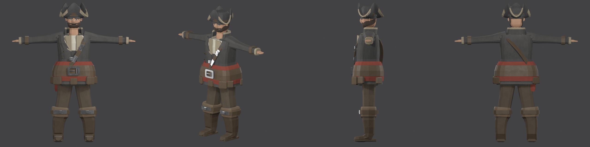

---

## 📦 O que tem aqui

| Arquivo | O que é |
|---|---|
| `pirate_character.blend` | Cena completa (malha + rig + materiais + texturas + animação) |
| `export/SK_Pirate.fbx` | FBX com esqueleto e animação — Unreal, Unity, Maya |
| `export/SK_Pirate.glb` | glTF binário com texturas e animação — Godot, web, three.js |
| `textures/T_Pirate_*.png` | Atlas 4096² — base color, metallic, roughness, normal, AO |
| `scripts/` | O pipeline inteiro em Python |
| `preview/` | Renders de conferência e testes de pose |

---

## 📊 Especificação técnica

| Item | Valor |
|---|---|
| **Triângulos** | 8.960 |
| **Vértices** | 4.610 |
| **Faces** | 3.982 quads + 996 tris, **zero n-gons** |
| **Altura** | 1,80 m (1,95 m com o chapéu) |
| **Bones** | 43 (42 deformáveis) |
| **Influências por vértice** | máx. 4 (limite de engine respeitado) |
| **Material** | 1 (atlas único) |
| **Texel density** | 8,69 px/cm @ 4K |
| **Escala** | 1 unidade = 1 metro, transforms aplicados, origem no chão |

> [!note] Por que 8,9k tris
> Faixa de **NPC principal / personagem de jogo estilizado**. O orçamento foi
> gasto onde muda a silhueta — chapéu, botas, dobras do casaco — e não em
> subdivisão uniforme.

---

## 🦴 O rig

Hierarquia padrão de engine, com sufixos `.L`/`.R` (o Blender reconhece simetria):

```
root
└── pelvis
    ├── spine_01 → spine_02 → spine_03
    │   ├── neck → head
    │   └── clavicle.L/R → upperarm → lowerarm → hand
    │       ├── finger_index/middle/ring/pinky_01 → _02
    │       └── thumb_01 → thumb_02
    └── thigh.L/R → calf → foot → toe
```

Mãos com **dedos articulados** (2 bones cada + polegar), então dá pra fechar punho,
segurar arma e apontar.

### Como o skinning foi resolvido

Pesos automáticos sozinhos não bastam num personagem feito de peças separadas.
Três passes de correção rodam depois:

1. **Vértices órfãos** → bone mais próximo (distância ponto-segmento). O solver de
   heat weighting não alcança ilhas isoladas.
2. **Whitelist de bones por peça** → o casaco só pode usar `pelvis`/`spine`/`clavicle`.
   Sem isso, agachar puxava o torso junto com a coxa.
3. **Adereços colados no vizinho** → fivelas, botões e lapelas herdam o peso do
   vértice mais próximo *fora* da própria ilha, senão saem flutuando na primeira pose.

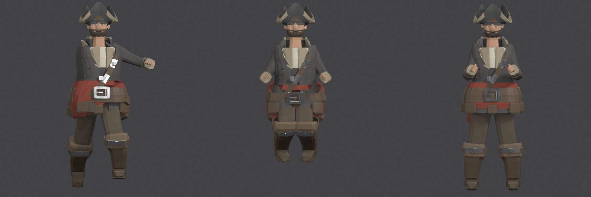

---

## 🏃 As animações

Dois ciclos, ambos gerados pelo mesmo motor (`anim_gait.py`). As pernas **não são
posadas à mão**: descreve-se a trajetória do pé e o joelho sai de uma IK de dois
elos resolvida por lei dos cossenos.

| | 🚶 Walk | 🏃 Run |
|---|---|---|
| Duração da passada | 0,800 s (24 q) | 0,600 s (18 q) |
| Passo | 0,66 m | 1,10 m |
| Cadência | 150 passos/min | 200 passos/min |
| **Velocidade nativa** | **1,65 m/s** | **3,67 m/s** |
| Apoio | 58% do ciclo | 31% |
| Quadros em voo | nenhum | **6 de 18** |
| Sobe-e-desce do corpo | 4,2 cm | 6,9 cm |
| Escorregamento do pé | **0,003 mm** | **0,004 mm** |
| Bota dentro do convés | 1 mm | 0 mm |

### O que impede o pé de patinar

Durante o apoio, o pé anda para trás **na velocidade exata do corpo** — é uma
linha reta no tempo, não uma curva suavizada. O resto do ciclo se dobra em volta
disso: a altura do corpo é a maior que a perna alcança sem arrancar o pé do chão,
e a altura do tornozelo sai da envoltória da sola girada, para a bota rolar sobre
o convés em vez de atravessá-lo.

> [!note] O corpo não persegue o limite da perna
> A primeira versão colava o quadril na altura máxima quadro a quadro e o
> resultado saltava **7 cm num único frame**: no fim do apoio a perna esticada
> deixava o corpo subir, e no quadro seguinte o outro pé tocava o chão e exigia
> tudo de volta. Corpo real descreve uma curva suave que passa *por baixo* do
> limite — que é o que o script faz agora.

### Correr não é andar rápido

Três coisas mudam de natureza, e não de grau:

1. **Fase aérea.** Com apoio em 31%, seis dos dezoito quadros não têm pé nenhum
   no chão. É ela que permite passo grande sem o corpo ter de descer.
2. **A curva vertical inverte.** Andando, o corpo fica baixo com as pernas
   abertas e alto ao passar sobre o pé. Correndo, fica baixo **no meio do apoio**
   (a perna absorve como mola) e alto **no meio do voo**.
3. **O pé toca quase sob o corpo.** Pisar à frente é *overstriding* — o pé vira
   freio. Um terço da excursão à frente, dois terços atrás.

### Por que nenhuma bate a velocidade do jogo

`WALK_SPEED` é 2,8 m/s e `RUN_SPEED` é 4,7 m/s; os clipes andam 1,65 e correm
3,67. Não é desleixo, é o que esta perna alcança: com 0,788 m entre quadril e
tornozelo, andar a 2,8 m/s exigiria passo de 1,12 m, e o quadril teria de descer
tanto para o pé chegar lá que a caminhada viraria agachamento andando.

O acerto é no runtime, com `timeScale = velocidade / velocidade_nativa` — e, na
faixa do meio, **misturando os dois clipes** em vez de esticar um.

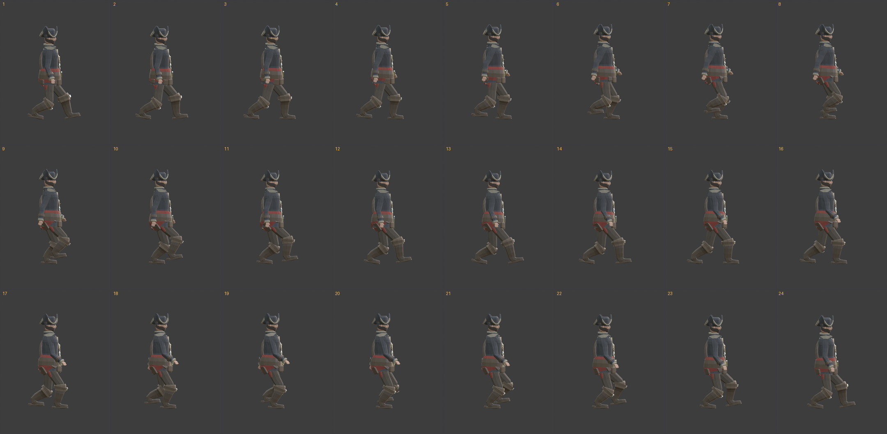
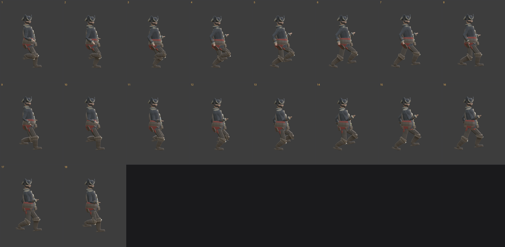

### 🪜 Escalada

O primo vertical da caminhada, e com o mesmo contrato: **a fase avança pela
altura vencida, não pelo relógio**. Enquanto a mão segura, o degrau está parado
no mundo — no referencial do corpo ele desce numa reta, na velocidade exata da
subida. São quatro contatos em vez de um, e a régua está na tela: o degrau.

| | 🪜 ClimbUp |
|---|---|
| Ciclo | 1,0 s (30 q) — **dois enfrechates**, 60,67 cm |
| Velocidade nativa | 0,607 m/s (2 degraus/s) |
| Apoio | mão 58% do ciclo, pé 46% |
| Deslizamento da mão / do pé | **0,000 mm** / **0,002 mm** |
| Mão envolvendo a barra | 2,5 cm |
| Extensão máxima braço / perna | 85% / 96% |

O ciclo mede dois degraus porque a escada do navio mede **30,33 cm** entre barras
— o `round` do `ShipParts.ts` arredonda o número de vãos, não o espaçamento. Como
a subida por ciclo é múltiplo inteiro disso, dá para **casar a fase com a altura
absoluta** ao agarrar: a mão cai em cima da barra desenhada, e continua caindo os
nove metros inteiros. Descer é o mesmo clipe com a fase andando para trás, o que
garante que os contatos da descida usem a mesma grade da subida.

> [!warning] Dois defeitos de skinning que este clipe desenterrou
> Escalar levanta o joelho a 90° e o ombro a 9° — nenhuma animação anterior
> chegava perto disso. Apareceram duas heranças de peso erradas que estavam
> latentes desde sempre: seis ilhas do casaco com até **97% de peso na coxa** (a
> fralda subia junto com a perna) e a **clavícula com 35% de influência na saia e
> 50% no tronco** (levantar o ombro balançava a roupa inteira). As correções
> estão em `build_rig.py` e valem para todos os clipes.

> [!note] Medir a pose construída não prova nada
> As métricas do `build` mediram contato perfeito enquanto o personagem agarrava
> o ar cinco centímetros ao lado da barra. O `_key_frame` do `anim_gait` não grava
> a clavícula — e a IK do braço tinha resolvido a pose *sobre o ombro deslocado*.
> Daí existir `verify()`: ele relê a **action gravada**, deforma a malha e mede a
> geometria da mão contra o cilindro da barra.

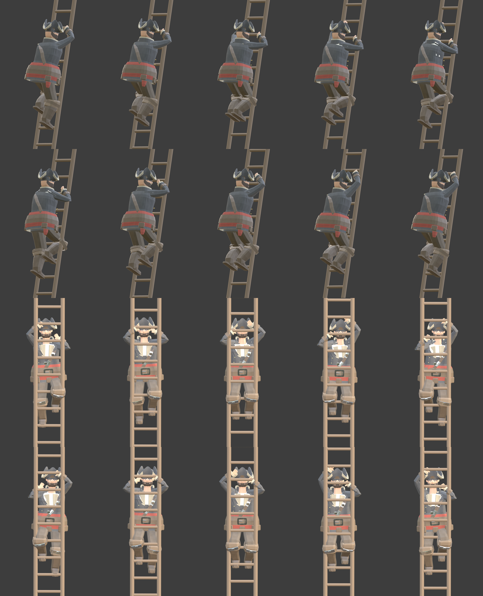


### 🎡 Timão

O terceiro clipe casado com a geometria do navio, e o de encaixe mais limpo dos
três. A roda tem **oito punhos** e dá **exatamente uma volta** de batente a
batente, então um ciclo do clipe cobre **45° — um passo de punho** — e a fase sai
direto do ângulo do leme:

```
fase = frac(ângulo_da_roda / (π/4))
```

Sem alinhamento inicial. A escada precisa de um (`ClimbClock.align`) porque a
grade de degraus é uma régua no mundo e a fase tem de ser casada com ela ao
agarrar; aqui a grade **é** o próprio ângulo, então a mão cai em cima de um punho
desenhado em qualquer posição do leme, inclusive quem começa a girar do meio.
Girar para bombordo é o mesmo clipe com a fase andando para trás.

| | 🎡 Helm |
|---|---|
| Ciclo | 0,833 s (25 q) — **45° de roda**, um punho |
| Indexado por | **ângulo da roda** (`wheelAngle`) |
| Arco da mão direita / esquerda | 56,7°–87,3° / 92,7°–123,3° |
| Extensão máxima do braço | **87,5%** |
| Mão envolvendo o punho | 2,23 cm |
| Escorregamento da palma / ciclo | 0,32 mm |
| **Deriva da mão nos 360° do curso** | **0,53 mm** |
| Folga do tronco até a madeira | 11,7 cm |
| Regimes | 48% com as duas mãos · 40% com uma · 12% sem nenhuma |

> [!warning] O posto estava 20 cm além do braço
> `HELM_STAND` punha o timoneiro a **0,85 m** do plano da roda. O braço deste rig
> tem **0,662 m** do ombro à ponta da mão, e o ombro fica 1,462 m acima dos pés —
> a distância até o punho de topo dava **0,862 m**. Em primeira pessoa piorava:
> o recuo de 11 cm do corpo *soma* ao vão, porque no timão o corpo aponta para a
> proa.
>
> Os 0,85 m nunca foram uma medida de braço. Foram escolhidos por enquadramento,
> quando o jogador ainda era uma câmera sem corpo — e o defeito não aparecia,
> porque no timão o personagem tocava `Idle` de mãos vazias. **O bug nasceu junto
> com a animação que deveria escondê-lo.** O posto veio para 0,62 m, e o raio do
> blocker do timão caiu de 0,5 para 0,32 junto, senão o jogador passa a ser
> expelido da estação ao chegar a pé.

> [!note] Os dedos não fecham em volta do punho
> O punho da roda tem **Ø 9,5 cm** contra uma mão de 5,8 × 3,0 cm. A pose é mão
> em concha por cima, não punho fechado — 2,2 cm de envolvimento é o máximo que a
> anatomia permite. Punho de roda de leme real tem uns 4 cm; afinar `createWheel`
> resolveria de vez, e vale as duas variantes.

A variante preterida continua reconstruível: `anim_helm.build(anim_helm.INTACT)`
grava `_HelmIntact`, com o posto original de 0,85 m e o tronco dobrado 18° para
alcançar. O prefixo `_` faz o `export.py` descartá-la sozinho.

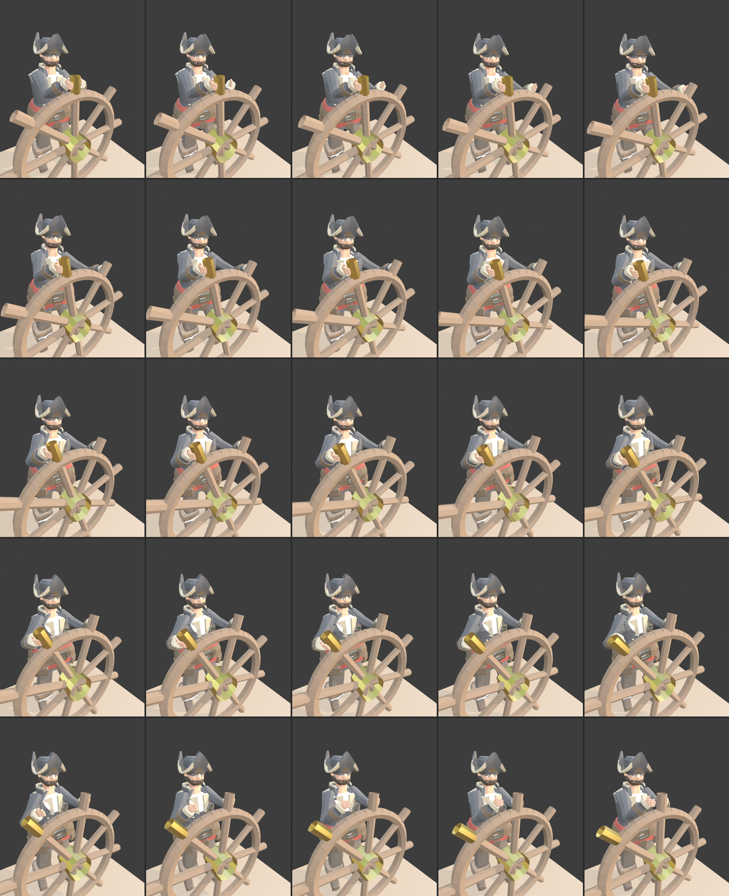
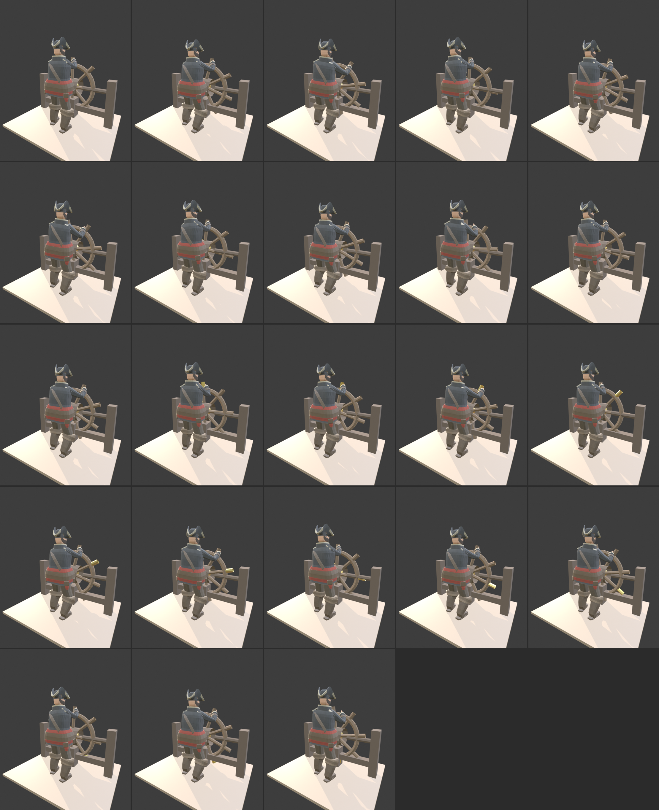

---

## 🌊 Os dois clipes de água

> [!warning] Estes dois ainda **não estão no GLB**
> `Float` e `Swim` estão gerados, medidos e conferidos em vídeo, mas o `.blend` não
> foi salvo e o `export.py` não rodou: eles entram no jogo depois da aprovação de
> quem vai olhar o clipe rodando. Até lá, quem nada no Sea of Opus usa a locomoção
> emprestada. Reconstruir os dois é `anim_float.build()` e `anim_swim.build()`.

Nos clipes de terra `z = 0` é o chão, sob os pés. Nestes dois é a **linha d'água** —
o corpo fica repartido nela, e é o `root` que o posiciona. Nenhum dos dois anima a
subida e a descida pela onda: quem ergue o avatar é o runtime, e repetir isso aqui
daria dois balanços somados.

### 🛟 Float — boiando parado

O `Idle` da água, e o primeiro clipe da pasta **sem um único ponto de contato**.

| | 🛟 Float |
|---|---|
| Ciclo | 7,0 s (210 q) — **3 pernadas · 5 varreduras de braço · 2 respirações** |
| Folga do queixo à superfície | **11,83 cm** no pior quadro |
| Ombro acima da linha d'água | 11,23 cm |
| Fração submersa | 56,3%, espalhamento 1,45 pp |
| Micro-oscilação vertical | 2,48 cm (teto de 3 cm) |
| Coxa à frente da vertical **do mundo** | 5° – 30° – 53° |
| Ângulo do joelho | 105° – 117° – 134° |
| Órbita do tornozelo (lateral / vaivém / vertical) | 47,6 / 35,0 / 17,5 cm |
| Extensão máxima perna / braço | 92,4% / 90,3% |

Os três períodos são **primos entre si dois a dois**: 3, 5 e 2 só se reencontram
depois dos 7 segundos inteiros, então o olho não cronometra o laço. É a mesma defesa
que o `anim_idle` promete no comentário e não entrega — lá o `build` multiplica o
balanço de volta ao período da respiração.

A pernada é um **eggbeater**: cada perna varre um cone em torno de um eixo que pende
do quadril, e as duas varrem em **sentidos opostos** — daí o nome, e é dessa oposição
que vem o cancelamento de torque que mantém o corpo de frente. A abdução é espelhada
entre os lados; a flexão não é. Só essa assimetria produz a contra-rotação.

> [!warning] A primeira versão desenhou uma cadeira, e o conserto tentado piorou
> A pernada nasceu como **elipse no plano sagital** — pedalar devagar —, e elipse
> sagital sempre lê como pedalar *sentado*. O defeito foi identificado, e a tentativa
> de conserto foi reclinar o tronco de 18° para 22°, anotando que "cada grau de
> reclinação **tira** um grau da inclinação da coxa no mundo".
>
> É o contrário. Reclinar gira o referencial do corpo para trás, e um vetor que
> apontava para baixo passa a apontar para baixo **e para a frente**: a reclinação
> **soma**. Medida na action gravada, a coxa não estava a 26° — estava a **71° à
> frente da vertical do mundo**, 89° no pior quadro, ou seja horizontal. Os 4°
> compraram 4° a mais de cadeira e ainda abaixaram o queixo, porque a cabeça fica
> *acima* do pivô de reclinação.
>
> O conserto foram três coisas ao mesmo tempo: tirar a perna do plano sagital (joelho
> para **fora**, como sapo, em vez de para a frente), descrever o tornozelo a **raio
> quase constante** para o joelho não fechar, e devolver a reclinação a 15°. Coxa:
> 71° → **30°**. Joelho: 98° → **117°**.

> [!note] Medir no referencial do corpo não prova nada
> Mesmo defeito de família da nota da escalada, um andar acima: lá a métrica media a
> pose *construída* em vez da gravada; aqui media o ângulo certo no **referencial
> errado**. As constantes da perna são escritas no corpo porque é o que faz um clipe
> sem contato nenhum continuar coerente enquanto o corpo gira — mas a leitura de
> "sentado" acontece no mundo, que é onde a câmera está. `verify()` passou a devolver
> `thigh_pitch_deg` e `knee_angle_deg` lidos da action, no mundo.

Os braços fazem **sculling**: varrem a água num oito deitado com a palma virada
**contra o próprio movimento** e inclinada para baixo. A regra da palma é o que
sculling *é* — a mão vira remo, e a componente para baixo da força segura o corpo.
Ela sai da trajetória por diferença finita, então continua certa se alguém mexer no
oito.

O afundamento é escolhido **acima do equilíbrio físico, de propósito**. Um corpo
humano boiando parado tem a água no queixo; este fica com a água no peito. O runtime
só conhece a altura da onda aproximadamente, e o custo de errar para baixo é a cabeça
entrar na água — a única coisa que o jogo promete que não acontece.

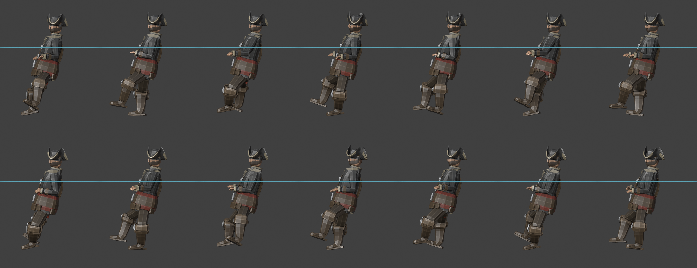
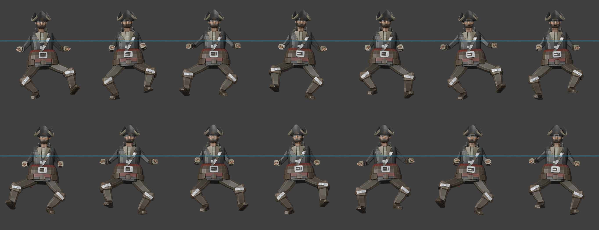

### 🏊 Swim — crawl de cabeça erguida

O jogo não deixa mergulhar, e essa regra escolhe o estilo: crawl de competição
respira de lado e passa metade do ciclo com o rosto na água, então sobra o **crawl de
cabeça erguida**, o nado de resgate. Mesma braçada alternada, tronco mais inclinado,
pescoço estendido, rolamento cortado à metade.

| | 🏊 Swim |
|---|---|
| Ciclo | 1,0 s (30 q) — uma braçada, 120 braços/min |
| Indexado por | **distância percorrida** — 1,32 m por ciclo |
| **Velocidade nativa** | **1,32 m/s** (jogo: 1,40 → `timeScale` 1,06) |
| Varredura da mão na água | 110,2 cm por braço |
| Eficiência propulsiva | 0,599 |
| Mão na água | 60% do ciclo por braço |
| Inclinação do tronco | 19,8° (**resolvida**, não escolhida) |
| Folga do rosto à superfície | 3,51 cm · pescoço +0,39 cm |
| Corpo submerso | 51,3% – 55,8% |
| Pernada | 6 batidas/ciclo, 38,2 cm de excursão de tornozelo |
| Extensão máxima braço / perna | 97,2% / 98,1% |
| Fecho do laço | **0,000 mm** |

A origem cai sobre o **esterno**, e não sob os pés: girar o corpo sem transladar
deixaria a origem nos calcanhares e o avatar apareceria um metro e meio à frente da
posição do jogador.

> [!note] A folga do rosto é **entrada** do problema, não conferência depois
> `solve_attitude()` não escolhe a atitude do tronco: ele bissecciona sobre ela,
> posando o corpo, deformando a malha pelo depsgraph e lendo o ponto mais baixo da
> cabeça, até a folga pedida sair. A extensão cervical fica fixa nos 42° anatômicos
> porque ela **tem batente** (~70°, e perto dele o pescoço lê como quebrado); quem se
> ajusta é o tronco, que só custa arrasto — que é exatamente a moeda que este nado
> gasta.

> [!warning] O cabeceio pivotava nos pés
> As duas rotações do `root` giram em torno da origem do rig, e antes da translação a
> origem está **nos pés**. Um cabeceio de 1,4° de braçada em torno de um pivô a 1,13 m
> do esterno movia o corpo **2,8 cm**: o rosto, com 4,7 cm de folga na pose neutra,
> encostava na água no quadro 14. Aplicado depois do deslocamento, o pivô vira o
> próprio esterno e o cabeceio move 1,2 mm.

> [!note] Arquear vale o dobro de estender o pescoço
> Cada 6° de arco compram 6,5° de inclinação de tronco; cada 10° de pescoço compram 3
> — arquear gira o corpo inteiro acima da lombar, e a cabeça vai junto. Com arco de 8°
> a folha de contato mostrava alguém **mergulhando ladeira abaixo**, a 28°. Com 16°
> são 19,8°, o meio da faixa real do crawl de cabeça erguida (15–25°).

O que faz a braçada ler como água e não como ginástica é a **velocidade irregular ao
longo do caminho** — a mão entra a 1,6 m/s, o empurrão vai a 4,2 m/s, a recuperação
cruza solta e desacelera para entrar — e a **palma virando ao longo do gesto**: de
gume na entrada, para trás na apanhada, para dentro na varredura em S, para cima na
saída, solta na recuperação. As trilhas interpolam por **Catmull-Rom cíclico** e não
por `smoothstep` entre chaves: `smoothstep` zera a derivada em cada chave, e onze
chaves por segundo seriam a mão parando onze vezes por braçada.

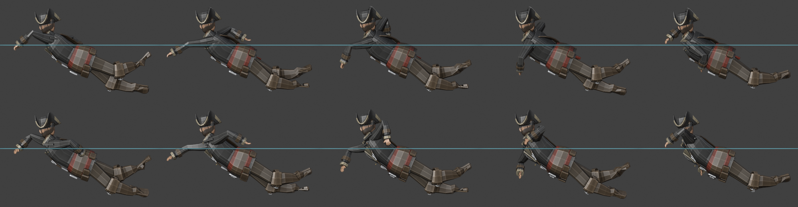
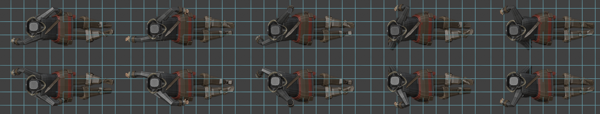

---

## 🎨 Texturas

Os materiais são **procedurais** (ruído + realce nas quinas pelo *pointiness* da
geometria) e depois **bakeados** para um atlas 4K. É isso que dá o desgaste nas
arestas sem pintar nada à mão.

| Mapa | Sufixo | Espaço |
|---|---|---|
| Base Color | `_D` | sRGB |
| Metallic | `_M` | Non-Color |
| Roughness | `_R` | Non-Color |
| Normal | `_N` | Non-Color |
| Ambient Occlusion | `_AO` | Non-Color |

> [!warning] Base color se bakeia por EMIT, não por DIFFUSE
> O passe `DIFFUSE` de um material com `Metallic = 1` retorna **preto** — metal não
> tem componente difusa. Todas as fivelas saíram pretas na primeira tentativa. A
> solução é redirecionar o socket para um nó Emission e bakear com `type="EMIT"`.

---

## 🔁 Reconstruindo do zero

Com o Blender aberto e o addon MCP conectado:

```python
import sys
sys.path.insert(0, r"...\PirateCharacter\scripts")

import build_all, materials, finalize, build_rig, export
import anim_walk, anim_run, anim_idle, anim_jump, anim_climb, anim_helm

build_all.run()              # geometria (limpa a cena antes)
materials.apply_materials()  # materiais procedurais por objeto/face
finalize.run()               # join + UV + bake do atlas + material final
build_rig.run()              # armature + skinning + correções de peso
anim_walk.build()            # ciclo de caminhada
anim_run.build()             # ciclo de corrida
anim_idle.build()            # parado, respirando
anim_jump.build()            # JumpAir + JumpLand
anim_climb.build()           # ciclo de escalada
anim_helm.run()              # as duas variantes do timão (Helm + _HelmIntact)
export.run()                 # valida e exporta .blend / .fbx / .glb
```

Depois de mexer na escalada, vale rodar as duas conferências — elas medem coisas
diferentes e a primeira já mentiu uma vez:

```python
anim_climb.verify()          # relê a action e mede a mão contra a barra
anim_climb.clearance()       # quanto o corpo entra na escada
anim_climb.bake_preview()    # monta a subida navegável para dar Play
```

O timão tem as mesmas conferências, mais uma que a escada não precisava — a
varredura do curso inteiro do leme:

```python
anim_helm.verify(anim_helm.NEAR)       # mede a palma contra o cilindro do punho
anim_helm.sweep_check(anim_helm.NEAR)  # 361 ângulos de leme: a mão deriva quanto?
anim_helm.clearance(anim_helm.NEAR)    # quanto o corpo entra na roda
```

> [!warning] Passe a variante explicitamente
> O parâmetro `variant` ainda tem `INTACT` por default, e `INTACT` é a variante
> **preterida**. Chamar `anim_helm.verify()` sem argumento mede a pose que não
> está no jogo, e ela passa em tudo — só que medindo outra coisa.

O pipeline inteiro roda em **~60 segundos**.

### Os scripts

| Script | Papel |
|---|---|
| `piratelib.py` | Motor de construção: sweep com *parallel transport*, superelipses, facetamento |
| `proportions.py` | Todas as medidas, extraídas da referência em px e convertidas pra metro |
| `build_body.py` | Torso, casaco, mangas, mãos, calças, botas |
| `build_head.py` | Crânio, feições, barba e o tricórnio |
| `build_gear.py` | Faixa, cinto, fivela, bandoleira, bolsos, botões |
| `materials.py` | Shaders procedurais + atribuição por face |
| `finalize.py` | Join, UV unwrap, bake, material final |
| `build_rig.py` | Armature, skinning e as correções de peso |
| `pose_test.py` | Poses de validação (eixos do mundo, não euler local) |
| `anim_gait.py` | Motor de marcha: IK, envoltória da sola, curva do corpo |
| `anim_walk.py` | Os números que fazem a caminhada |
| `anim_run.py` | Os números que fazem a corrida |
| `anim_idle.py` | Parado no convés, respirando |
| `anim_jump.py` | `JumpAir` (lido pela velocidade) + `JumpLand` |
| `anim_climb.py` | Escalada: quatro contatos na grade de degraus do navio |
| `anim_helm.py` | Timão: as mãos na grade de punhos da roda, lido pelo ângulo do leme |
| `anim_preview.py` | Renderiza um ciclo em três vistas, para conferência |
| `export.py` | Checklist pré-export + FBX/GLB |
| `preview.py` | Folhas de contato pra comparar com a referência |

---

## 🧠 Como a semelhança foi obtida

Nada de "modelar no olho". As proporções saíram de **medição na arte de referência**:
ancorando o topo do crânio e a sola em px e convertendo pra uma altura-alvo de 1,80 m,
sai a escala de `1 px = 0,00178 m` — e daí todos os landmarks.

Foi assim que apareceram as características que fazem o personagem parecer *ele*:

- 🦵 **Pernas curtas** — entrepernas a 44% da altura (humano médio: 47–48%). É daí que
  vem o aspecto atarracado.
- 🎽 **Quadril mais largo que os ombros** — por causa do cinto e das abas do casaco.
- 🎩 **Tricórnio de 20 cm** de altura, com a aba dobrada em três setores e as pontas
  passando acima da copa.
- 🧔 **Barba com borda superior variável** — para abaixo do lábio na frente e sobe até
  a costeleta nas laterais, seguindo a linha real da mandíbula.

### Detalhes do rosto

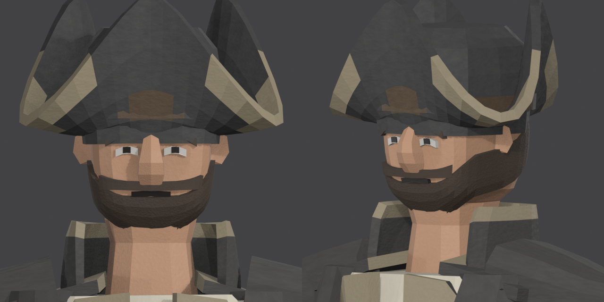

Cada feição é **ancorada matematicamente na superfície do crânio** (a função inverte
a parametrização da superelipse pra achar o Y da pele em cada X e Z). Posicionar "no
olho" afundava a geometria dentro da cabeça e ela simplesmente sumia do render.

---

## ⚠️ Limitações conhecidas

- **Faltam clipes.** Existem caminhada, corrida, parado, pulo, escalada e timão;
  faltam o canhão e a bomba de porão.
- **O timão não lê o ângulo absoluto do leme**, só a fase. Um timoneiro se
  escorando numa guinada a todo bordo exigiria um segundo clipe ou uma camada
  aditiva — e o motor não tem aditivo hoje.
- **12% do ciclo do timão fica sem mão na roda.** É o preço de as duas mãos não
  disputarem o mesmo punho: com a janela mais larga a medição achou 6 cm entre as
  palmas, contra 9 cm de largura de mão — elas se atravessavam. Parado, há 12% de
  chance de o leme congelar num quadro com uma mão no ar.
- **Não há `ClimbHold`.** Parado na escada, o runtime congela a fase e o
  personagem fica agarrado exatamente onde estava — sem deslizar, mas também sem
  respirar. Um "agarrado respirando" só funcionaria como camada **aditiva**: como
  pose cheia ele mandaria as quatro pegadas para as barras dele e arrastaria as
  mãos até 15 cm na transição.
- **Braço e perna raspam o montante** na escalada, até 3,7 cm em quadros
  isolados. Com o corpo a 29 cm da escada e os montantes a 24 de cada lado, algum
  membro passa por ali no caminho até a barra — quatro larguras de pegada foram
  testadas e o número muda de dono, não de tamanho.
- **Sem LODs.** Para uso em jogo com muitos personagens em tela, vale gerar LOD1/LOD2.
- **Sem blend shapes faciais.** A topologia da cabeça é de personagem estilizado, sem
  loops concêntricos em olho e boca — expressão facial exigiria retopologia da cabeça.
- **Peças interpenetram** (bota × calça, fivela × cinto). É prática normal em low-poly
  estilizado e invisível no resultado, mas significa que a malha tem geometria interna.
- **Sem rig de controle** (IK, controladores). É um esqueleto de deformação puro —
  ótimo pra engine, mas um animador ia querer IK nos pés e nas mãos.
