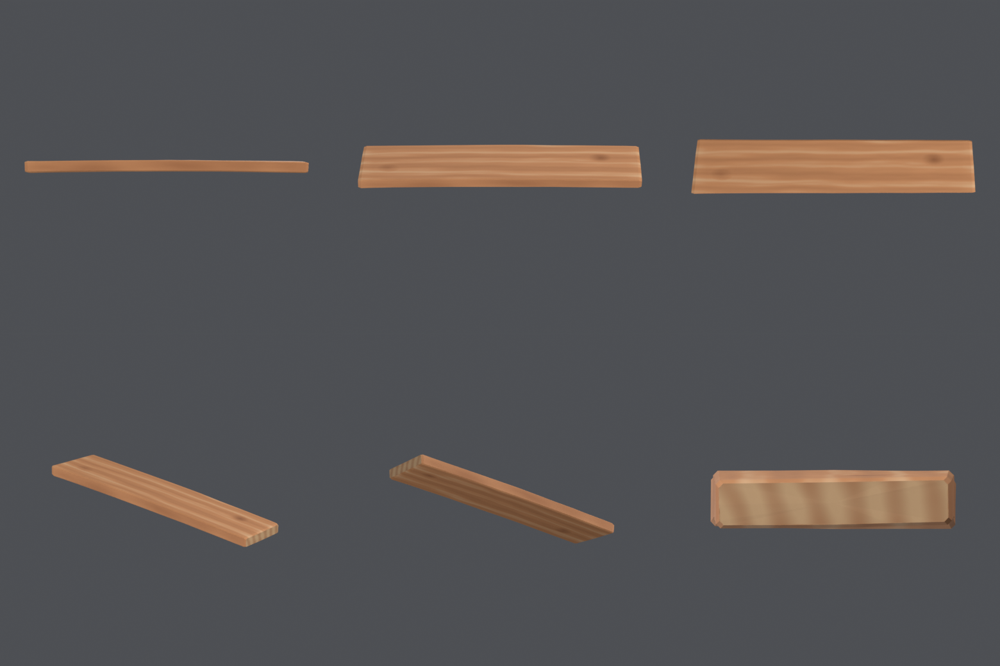
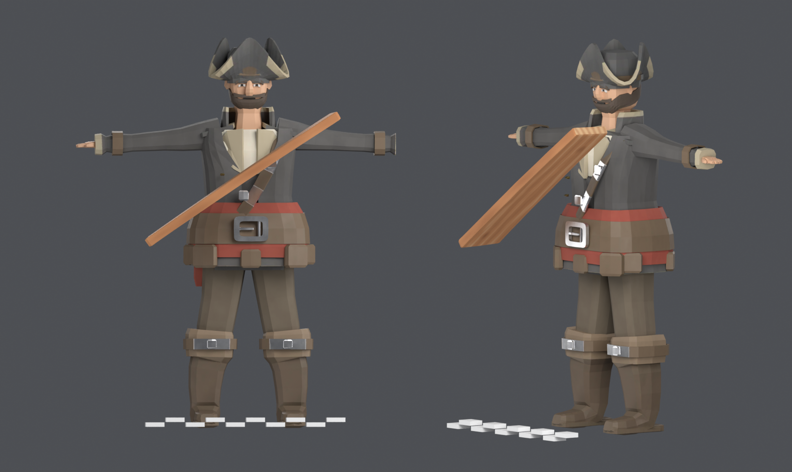
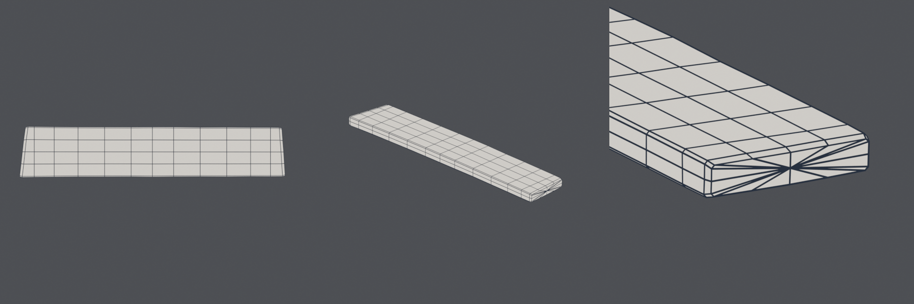
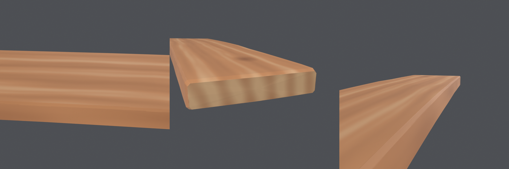

# 🪵 Wooden Plank — a tábua de reparo

A tábua que o pirata carrega atravessada no peito para tapar buraco de casco, no
estilo do *Sea of Thieves*. **Modelada e texturizada inteiramente por script** no
Blender — dá pra apagar tudo e reconstruir com um comando.



---

## 📦 O que tem aqui

| Arquivo | O que é |
|---|---|
| `plank.blend` | Cena completa (malha + materiais + texturas) |
| `export/SM_Plank.glb` | glTF binário — three.js, Godot, web |
| `export/SM_Plank_web.glb` | O mesmo, com as texturas em WebP: **64 KB** contra 378 |
| `export/SM_Plank.fbx` | FBX — Unreal, Unity, Maya |
| `textures/T_Plank_*.png` | Atlas 1024² — base color, roughness, normal |
| `scripts/` | O pipeline inteiro em Python |
| `preview/` | Renders de conferência |

> [!note] `SM_`, não `SK_`
> *Static Mesh*. A tábua não tem esqueleto — o prefixo é o mesmo vocabulário que
> o personagem usa com `SK_Pirate`, só do outro lado da cerca.

---

## 📊 Especificação técnica

| Item | Valor |
|---|---|
| **Triângulos** | **480** |
| **Vértices** | 242 |
| **Faces** | 224 quads + 32 tris, **zero n-gons** |
| **Malha** | fechada: 0 arestas de borda, 0 non-manifold, 0 normais invertidas |
| **Dimensões nominais** | **1,15 × 0,22 × 0,045 m** |
| Caixa envolvente | 1,150 × 0,221 × 0,053 m |
| Largura real (anel a anel) | 213,2 – 219,6 mm |
| Espessura real (anel a anel) | 44,8 – 47,2 mm |
| **Material** | 1 (`M_Plank`, atlas único) |
| **Texel density** | **8,83 px/cm @ 1024²** |
| Mapas | Base Color, Roughness, Normal |
| **Escala** | 1 unidade = 1 metro, transforms aplicados, **origem no centro** |
| Peso do GLB | 378 KB (autoria) / **64 KB** (WebP) |

> [!note] 480 tris é 5,4% do personagem
> O pirata inteiro custa 8.960. Uma tábua tem de custar uma fração disso, e cada
> triângulo aqui está pagando silhueta: chanfro, empeno, ondulação da aresta e
> corte enviesado das pontas. Nenhum foi gasto em subdivisão uniforme.

> [!warning] A caixa envolvente **não** é a espessura da peça
> A caixa dá 53,2 mm e a tábua tem 45. A diferença é o empeno: o meio da peça
> sobe 6 mm, e a caixa soma isso. Quem quiser a medida de trena tem de medir
> **anel por anel** — é o que `build_plank._section_sizes` faz, e é de lá que
> saem os 44,8–47,2 mm da tabela.

---

## 📐 De onde vêm as medidas

Nada foi escolhido no olho. Cada número tem três fontes cruzadas — o jogo, o
personagem e marcenaria naval real — e todas batem.

| Medida | Valor | Por quê |
|---|---|---|
| **Largura** | **0,22 m** | É *exatamente* a largura do tabuado do convés da Chalupa: `HullGeometry.ts` mapeia `DECK_BAND_TILE = 1,76 m` sobre uma textura de `planks: 8` → 1,76 / 8 = 0,22. O jogador pisa nessa largura o jogo inteiro. |
| **Comprimento** | **1,15 m** | Pegada de ~0,58 m (o personagem tem 0,50 m de ombro a ombro) + 0,28 m de sobra de cada lado. Razão 5,2:1, dentro da faixa 5:1–6:1 medida no render de inventário do jogo. |
| **Espessura** | **0,045 m** | Tabuado de costado de sloop real: 1½"–2" (38–50 mm). Bate também com a razão do render oficial: espessura entre ⅕ e ¼ da largura. |

Referências externas que sustentam os números: a *shole* do manual de **damage
control da US Navy** (mínimo 1" de espessura, 8"–12" de largura), a definição
formal de "plank" (acima de 1½"; a DIN 68252 exige 40 mm) e o tabuado de convés
histórico (6"–12" de largura, 2½"–3½" de espessura).

**Confere no peso:** 0,0114 m³ × 700 kg/m³ (carvalho) = **8 kg**. Carga de duas
mãos. Uma tábua de estoque inteira, de 2,44 m, daria 17 kg e ninguém carrega isso
atravessado no peito — daí o corte curto.



> [!note] O pirata aparece em pose de repouso, de propósito
> O importador de glTF aplica a **primeira animação do arquivo**, e o
> `SK_Pirate_web.glb` leva cinco clipes. A primeira versão desta imagem saiu com
> o personagem no meio de um salto: flutuando, sem pé no chão, inútil como régua.
> `pose_position = "REST"` devolve a pose de bind, que é determinística e tem a
> sola em Z = 0. A régua no chão tem 1 m em barras de 10 cm.
>
> O GLB do personagem é aberto **somente para leitura**. Ele é o entregável de
> outro asset; nada neste pipeline o regrava.

---

## 🪚 O que impede a peça de ser um cubo esticado

A regra de arte que a Rare aplica no *Sea of Thieves* é **"realistically
wonky"**: o objeto tem de parecer usado, nunca saído de fábrica. Cinco coisas
fazem isso aqui, e **nenhuma custa triângulo** — todas moram em vértices que a
topologia já precisava ter.

| # | O quê | Quanto | Por quê |
|---|---|---|---|
| 1 | **Aresta longa ondulada** | ±4 mm | É a observação mais forte do render oficial: nenhuma linha da tábua é reta. A peça é lavrada, não aplainada. |
| 2 | **Pontas cortadas em plano enviesado** | 6,5° e −4° de guinada, ângulos diferentes nas duas | Serrote de bordo não faz esquadro. Corte limpo, porém torto — não lascado. |
| 3 | **Chanfro nas quatro arestas longas** | 4 mm | O que uma plaina de mão tira num passe. É a faixa que o *pointiness* clareia, e é ela que desenha o contorno da peça contra o fundo. |
| 4 | **Empeno + barriga** (*bow* + *cup*) | 6 mm no comprimento, 2,5 mm na largura | Toda tábua serrada tem. O *cup* move as **duas** faces para o mesmo lado, que é como madeira encana de verdade. |
| 5 | **Facetamento por ruído** | 1,2 mm | Mesma função do personagem (`piratelib.facet`). Subliminar de longe, quebra de luz de perto. |

Mais: conicidade de 3% de uma ponta à outra, torção de 1,8° no comprimento e
bisel de 3 mm em volta dos dois topos.



A topologia é um *sweep*: quinze seções transversais de dezesseis pontos
costuradas com quads, exatamente o motor que constrói o personagem
(`piratelib.sweep`). Triângulos só nas duas tampas, em leque a partir do
centroide.

> [!note] Por que a origem fica no centro
> É o ponto de equilíbrio da peça — o que a mão segura e o que a física vai usar
> como centro de massa quando a tábua for solta no convés. Com a origem numa
> ponta, a tábua orbitaria o punho em vez de girar nele.

---

## 🎨 A textura

Materiais **procedurais**, bakeados para um atlas. Dois shaders: a face serrada e
o **topo**. Separá-los não é preciosismo — madeira cortada de través é outro
material: bebe mais luz, é mais fosca e mostra os anéis em arco em vez de faixas
compridas.



O que decide a aparência, na ordem em que importa:

1. **Contenção.** A regra da Rare é literal: o asset carrega *"só detalhe
   suficiente para dar a impressão do que ele é"*. O render oficial da tábua tem
   **duas a quatro faixas largas** na face inteira e quase nenhum detalhe fino.
   Um veio de carvalho fotográfico aqui seria tecnicamente melhor e
   estilisticamente errado.
2. **Espaço de objeto, não UV.** Todo o desenho é amostrado nas coordenadas de
   objeto. O veio corre no comprimento da peça independentemente de como as ilhas
   caíram — e isso libera o empacotador de UV para otimizar área em vez de
   preservar um alinhamento que ninguém usaria.
3. **Pointiness nas quinas.** O mesmo termo que dá o couro puído do personagem
   aqui dá a quina lixada do chanfro.
4. **Nós que atravessam a peça**, com o veio abrindo em catedral ao contorná-los.
5. **Face estreita mais escura que a larga** — corte radial contra corte
   tangencial.

### A paleta

| Papel | Hex (sRGB) | Nota |
|---|---|---|
| Corpo | `#BE8355` | Tan/ocre, matiz 25°, S 0,55 |
| Veio escuro | `#96603A` | Um degrau de valor, não um contraste |
| Nó | `#5E3A22` | O único valor baixo da peça |
| Quina gasta | `#DCB98F` | Mais clara **e** dessaturada |
| Topo serrado | `#A5714B` / anéis `#6F4A2E` | |
| *(referência)* Convés da Chalupa | `#8F704F` | `ShipMaterials.ts`, matiz 31°, V 0,56 |

A tábua é madeira **recém-serrada**: sobe em valor e em saturação e desce em
matiz em relação ao convés lixado pelo sal. É por isso que ela pega o olho no
porão sem destoar do navio.

> [!warning] A referência submersa mentiu sobre a cor
> A primeira paleta saiu do screenshot do jogo — que é **debaixo d'água**, com
> filtro ciano por cima de tudo. Amostrada ali, a tábua dá `#964627`: laranja
> profundo. Copiado como albedo, isso virou uma tábua cor de salmão que lia como
> plástico. A água come o verde e o azul, então tudo lá dentro *parece* mais
> saturado do que é. O que a referência prova é a **relação** (a tábua é muito
> mais quente e mais clara que tudo em volta) e a **frequência** (variação larga,
> superfície quase chapada). O valor absoluto veio da paleta que o jogo já tem.

### Os mapas

| Mapa | Sufixo | Espaço | Existe? |
|---|---|---|---|
| Base Color | `_D` | sRGB | ✅ |
| Roughness | `_R` | Non-Color | ✅ |
| Normal | `_N` | Non-Color | ✅ |
| Metallic | `_M` | — | ❌ madeira é dielétrica pura; entra como escalar 0 |
| Ambient Occlusion | `_AO` | — | ❌ **medido**: oclusão média 0,9998, percentil 1 em 1,0 |

> [!warning] Base color se bakeia por EMIT, não por DIFFUSE
> A armadilha está documentada no `PirateCharacter/README.md` e o remédio é
> reusado daqui, importado de `finalize.py` em vez de recopiado. Aqui não há
> metal, então o sintoma seria outro — o passe `DIFFUSE` traria a cor *depois* da
> conta de luz, e não o valor cru que a engine espera —, mas a cura é a mesma.

> [!warning] O mínimo do mapa de AO mente
> O mínimo medido foi **0,039**, o que sugeriria oclusão profundíssima numa peça
> que não tem uma única reentrância. São os pixels da **borda da ilha de UV**,
> onde o raio de oclusão sai da superfície. Média 0,9998 e percentil 1 em 1,0
> contam a história verdadeira: o mapa é branco com uma franja. Por isso o corte
> é pela **média**, e por isso o `_AO` não é entregue.

---

## 🧵 UV e densidade de texel

**1024², e não 4096².** Medido, não estimado.

| | Tábua | Personagem |
|---|---|---|
| Área de superfície | 0,5986 m² | ~19 m² (com geometria interna) |
| Atlas | 1024² | 4096² |
| Uso do atlas | 44,5% | — |
| **Densidade** | **8,83 px/cm** | 8,69 px/cm |
| Memória dos mapas | ~350 KB em PNG | ~28 MB |

Os 44,5% não são desleixo do empacotador: a face larga é 5,2:1, e **oito
configurações** de `smart_project` + `pack_islands` (CONCAVE / CONVEX / AABB,
margens de 3 a 6 px, limites de ângulo de 45° a 89°) ficaram todas entre 39,9% e
44,7%. É o teto da forma dentro de um atlas quadrado.

**Por que 8,83 px/cm basta aqui**, apesar de prop de primeira pessoa viver na
faixa de 1024–2048 px/m: o que a textura carrega é gradiente largo. A faixa de
veio tem ~6 cm (53 texels) e o realce de chanfro, a menor feição do mapa, tem
4 mm (3,5 texels). Não existe detalhe fino para perder — a contenção de estilo do
*Sea of Thieves* é justamente essa.

> [!note] As duas alavancas, se um dia a quina ler mole em primeira pessoa
> 1. `plank_spec.ATLAS = 2048` — dobra tudo, o pipeline reconstrói sem mais nada,
>    e custa 4× de memória.
> 2. Cortar as ilhas das faces largas ao meio no comprimento, para o empacotador
>    poder usar duas colunas. Vale **+21%** de densidade (8,83 → ~10,7) ao preço
>    de uma costura no meio da face. Não foi feito porque, com o desenho todo em
>    espaço de objeto, a costura não aparece na cor — mas também não paga o preço
>    de complexidade para uma textura sem alta frequência.

---

## 🔁 Reconstruindo do zero

**Sempre headless.** Existe uma instância de GUI do Blender aberta no projeto com
o personagem; nada aqui pode encostar nela.

```bash
"C:\Program Files (x86)\Steam\steamapps\common\Blender\blender.exe" \
  --background --python Props/Plank/scripts/build_all.py
```

Etapas soltas, na ordem em que aparecerem:

```bash
... --python build_all.py -- geo mat atlas
... --python build_all.py -- preview
```

Tempo total: **~70 s**, dos quais 60 são o Cycles dos previews. A geometria e os
materiais levam 0,01 s cada.

### Os scripts

| Script | Papel |
|---|---|
| `plank_spec.py` | Todas as medidas e cores, cada uma com a procedência ao lado |
| `build_plank.py` | A malha: sweep, ondulação, empeno, corte enviesado das pontas |
| `plank_materials.py` | Os dois shaders procedurais + atribuição por face |
| `plank_finalize.py` | UV, bake do atlas, material final |
| `plank_export.py` | Checklist pré-export, escrita de `.blend` / FBX / GLB / GLB web e **conferência do GLB gravado** |
| `plank_preview.py` | Os quatro renders de conferência |
| `build_all.py` | Ponto de entrada |

> [!note] A tábua importa o motor do personagem
> `piratelib.py` (sweep com *parallel transport*, superelipses, facetamento) e as
> partes delicadas de `finalize.py` (o desvio por Emission, a medida de densidade
> de texel) e de `preview.py` (câmera, luzes, escolha de engine entre versões)
> são **importadas** de `PirateCharacter/scripts/`, não copiadas. É um
> acoplamento consciente: existe uma armadilha documentada de bake no projeto, e
> ela tem de existir **uma vez só**.
>
> O preço é que renomear a pasta do personagem quebra a tábua — por isso
> `build_plank` falha com mensagem explícita se não achar o caminho. Quando
> chegar o terceiro prop (o balde), essas funções sobem para um lugar comum em
> vez de morar dentro da pasta de um asset.

> [!note] Por que os módulos têm prefixo `plank_`
> Os scripts do personagem entram no `sys.path` junto com estes. Dois
> `proportions.py`, dois `export.py` ou dois `preview.py` no caminho fariam o
> `import` pegar o errado **sem avisar**.

---

## ⚠️ As armadilhas que este asset desenterrou

**O Wave do Blender não conta ciclos como parece.** A onda é
`sin(coord · Scale · 20)`, então o período em metros é `2π / (20 · Scale)`. Em
Scale 18 — o palpite inicial — isso dá 17,5 mm: **doze faixas** atravessando os
22 cm da tábua. Renderizado, virou **veludo cotelê**: listra regular demais para
ser madeira e fina demais para o atlas sustentar. Em 5,0 o período sobe para
63 mm e sobram ~3,5 faixas, que é a leitura da referência.

**O bump quis ser dez vezes maior do que devia.** A primeira versão usava 0,9 mm
com força 0,5 e a tábua saiu **corrugada**, com brilho em faixas — cada anel
virou uma calha. Madeira intemperizada tem *décimos* de milímetro de alívio entre
lenho de primavera e de verão. 0,25 mm com força 0,3 é o que se vê de perto e
some de longe.

**O raio do nó não está em metros.** A janela do disco entrava como
`RAIO / ESCALA`, por analogia errada com unidades de mundo. A saída `Distance` do
Voronoi já vem no espaço multiplicado pela escala — o raio de uma célula vale
~0,5 ali dentro. Com o divisor, a janela ficava em 0,017 e **nenhum pixel
passava**: a tábua saiu sem um nó sequer e nada no log reclamou.

**E o Voronoi dos nós tem de ser 2D.** Com o campo em 3D, as sementes se espalham
também na espessura, e a tábua é uma fatia de 4,5 cm num espaço de células de
14 cm: o número esperado de nós na peça inteira dava **meio**. Em 2D o nó vira um
cilindro que atravessa a prancha — que é literalmente o que um nó é, o galho
cortado de lado a lado — e ele aparece nas duas faces, no mesmo lugar, de graça.

**O corte enviesado dobrava a geometria.** O desvio da ponta chega a 30 mm na
largura, enquanto o anel do bisel fica a 13 mm da ponta: movendo só o anel de
topo, o canto mais recuado passava **para trás** do bisel, a face virava do
avesso e aparecia um degrau de fatia arrancada na quina. Serrote corta um plano,
não um anel — os dois anéis da ponta andam juntos agora.

**E a pior de todas: `os.path.basename` mentiu sobre o caminho da textura.**
Depois de salvar o `.blend`, o Blender reescreve os caminhos das imagens para a
forma relativa dele — `//textures\T_Plank_D.png`. No Windows, o `ntpath` lê
aqueles dois primeiros caracteres como início de **caminho UNC**
(`\\servidor\compartilhamento`), engole a string inteira como "drive" e devolve
`basename() == ""`.

A cadeia de estrago, toda em silêncio: o alvo virava a *pasta* `textures\`;
`os.path.exists` dizia que sim, porque pasta existe; o código "consertava" o
caminho apontando a imagem para um diretório; o `reload()` esvaziava os pixels; e
o GLB web saía com **três texturas e uma imagem** — cor base, rugosidade e normal
todas no mesmo arquivo. Código de saída zero, um WARNING de uma linha perdido no
log, e um arquivo de 35 KB que abre sem reclamar em qualquer visualizador.

Duas correções, e a segunda é a que importa:

1. `bpy.path.abspath()` **antes** de qualquer `os.path`, e `isfile` em vez de
   `exists`.
2. **`inspect_glb`**: o pipeline agora abre o GLB que acabou de escrever, lê o
   bloco JSON e falha se alguma textura estiver sem imagem. Conferir o
   **artefato**, e não o processo, é a única checagem que não mente — foi ela que
   provou a correção, e é ela que impede este bug de voltar sem avisar.

> [!warning] O topo não estava escuro; a cena estava
> Nos primeiros renders o topo saía marrom-escuro, e a leitura natural era "o
> material do topo ficou escuro demais". Medido no atlas bakeado, o topo sai em
> `#BA8F67` — mais **claro** que a face. O que estava errado era a iluminação: o
> trio de luzes herdado do personagem vem todo de cima, de trás e da esquerda, e
> uma face olhando para +X recebia contribuição de exatamente uma delas.
> **Depurar o shader por causa disso teria estragado um material que estava
> certo.** A lição vale além daqui: antes de mexer no material, medir o mapa.

---

## 🧭 Limitações e decisões que valem revisão

- **Não há ponto de encaixe, nem rig, nem mãos.** Foi decisão de escopo: a tábua
  foi modelada, texturizada e entregue para aprovação; onde ela se prende ao
  personagem vem depois. Quando vier, o candidato natural é um *empty* na origem
  (que já é o centro de massa) e um bone `plank_socket` na mão direita.
- **Sem LODs.** Com 480 tris a peça já é praticamente um LOD; o que faria
  diferença numa pilha de tábuas é *instancing*, não LOD.
- **Sem variantes.** Toda tábua sai idêntica — mesmos nós, mesmo veio, mesmo
  corte. Num barril de cem, isso vai aparecer. A saída barata é somar um deslocamento
  aleatório por instância às coordenadas de objeto do shader (é o mesmo truque
  que a Rare usa nas rochas), mas isso exige que a tábua deixe de ser um atlas
  bakeado único — ou que se bakeiem duas ou três variantes.
- **A textura não ladrilha e nem deveria.** Diferente da madeira do navio
  (`ProceduralTextures.ts`), aqui o UV é um atlas de peça única.
- **Espessura de 45 mm é o número mais discutível.** Está no meio da faixa de
  costado real (38–50 mm) e bate com a razão do render oficial, mas é uma tábua
  **gorda**: 25,6:1 de comprimento por espessura, contra 32:1 de um 2×8 comercial.
  Foi escolhido assim de propósito — abaixo de ~35 mm o low-poly começa a parecer
  papelão. Se a tábua ler pesada demais na mão, é este número que muda.
- **O `_web.glb` não reduz resolução**, diferente do personagem (que desce de 4K
  para 2K). 1024² já é o mínimo que sustenta o realce do chanfro; o ganho de
  378 KB → 64 KB vem só do WebP.
