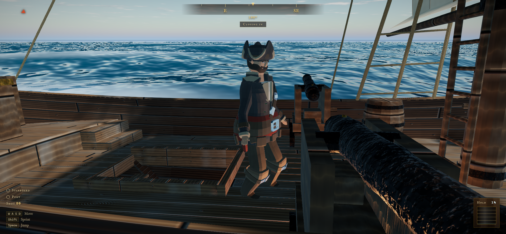
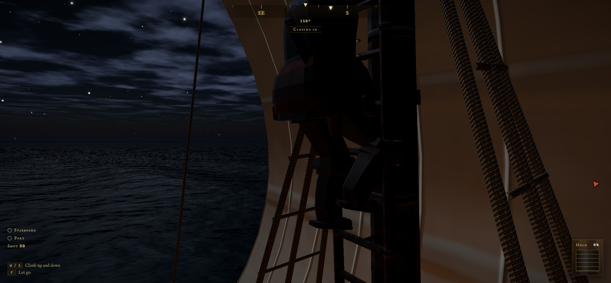
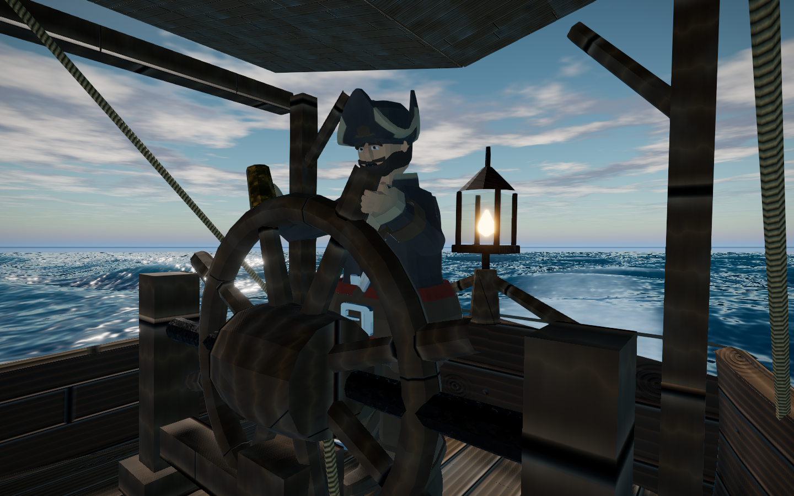

# 🏴‍☠️ Sea of Opus — Sloop Duels

A 3D naval combat game for the browser, inspired by Sea of Thieves. You command a
sloop single-handed — walk the deck, take the helm, drop the anchor, climb to the
topsail platform, load and lay the guns, go below to patch breaches and pump water
out — against an enemy sloop crewed by a two-man AI.

It runs in the browser on WebGL2. Hull, textures, sea, sky, rain and every sound are
**generated in code** — the only binary asset in the project is the character, and it
too came out of a script (see `PirateCharacter/`).



---

## Contents

- [🚀 Running it](#-running-it)
- [🎮 Controls](#-controls)
- [⚔️ How a duel is won](#️-how-a-duel-is-won)
- [🌩️ The weather](#️-the-weather)
- [🤖 The enemy AI](#-the-enemy-ai)
- [🏴‍☠️ The body aboard](#️-the-body-aboard)
- [🌊 What is actually simulated](#-what-is-actually-simulated)
- [🪵 Three parts of the ship that are gameplay](#-three-parts-of-the-ship-that-are-gameplay)
- [🎨 The interface](#-the-interface)
- [🗂️ Layout](#️-layout)
- [⚙️ Performance](#️-performance)
- [🧪 Tests](#-tests)
- [🧭 Status and what comes next](#-status-and-what-comes-next)
- [🌐 The networked duel](#-the-networked-duel)
- [📦 Stack](#-stack)
- [🤝 Contributing](#-contributing)
- [📄 License](#-license)

---

## 🚀 Running it

```bash
npm install
npm run dev      # dev server (Vite)
```

| Command | What it does |
|---|---|
| `npm run dev` | Starts the dev server with HMR |
| `npm run build` | Checks the types and produces `dist/` |
| `npm run preview` | Serves the built `dist/` |
| `npm run check` | Type check only (`tsc --noEmit`) |
| `npm run check:all` | Types for the game **and** the room server |
| `npm run dev:server` | Starts the local room server (`wrangler dev`, port 8930) |

> ⚠️ Audio only comes up after the **first click or keypress**. That is not a bug:
> every current browser refuses to start an `AudioContext` outside a user gesture.

### Dueling over the network locally

You need **both** servers up, each in its own terminal:

```bash
npm run dev          # the game, on :5173
npm run dev:server   # the room server, on :8930
```

`wrangler dev` runs the Durable Objects on your machine and **does not ask for a
Cloudflare account** — only `deploy` does.

To confirm in one second that the room server really is yours:

```bash
curl http://127.0.0.1:8930/health     # has to answer {"ok":true}
```

> ⚠️ **Why 8930 and not wrangler's default 8787.** On Windows, two processes can
> listen on the same port when the first one binds with `SO_REUSEADDR` — which is
> what `python -m http.server` does by default. When that happens, wrangler comes up
> announcing success and the connections go to the other process: the game gets a
> "connection dropped" with no clue attached, and there is no error to find
> anywhere. If the `/health` above returns HTML instead of JSON, that is exactly
> what happened — something else is on the port. The port is pinned in
> `server/wrangler.jsonc` and in `.env.development`; change it in one, change it in
> the other.

> ⚠️ Test in **two windows**, not two tabs. Browsers throttle
> `requestAnimationFrame` in a background tab, and since the host simulates both
> hulls, the whole duel stops. One normal window and one incognito is the quickest
> way — that way each has its own saved nickname.

---

## 🎮 Controls

Keyboard and gamepad work together, and the interface **swaps the labels the moment
you touch the pad** — not when it gets plugged in. Going back to WASD brings the
keyboard labels back (in game, moving the mouse is enough; in the menu, where the
cursor is free, it takes a key or a click).

On a Sony pad the labels come out in that layout: `✕ ○ □ △`, `L1/L2`, `Create` and
`Options`. The buttons are the same ones — only what is printed on them changes.

> 🖱️ **On mouse, click the screen once when you enter a match.** The browser only
> hands raw mouse movement to whoever has *locked the pointer*, and locking takes a
> gesture — there is no way for the game to do it by itself when the match starts,
> least of all online, where the start comes from the server and not from your hand.
> While the pointer is free, the game writes **"Click to look around"** at the
> bottom of the screen. Gamepad players never see that notice: the right stick looks
> around without depending on any lock.

| Action | Keyboard | Gamepad |
|---|---|---|
| Walk / run / jump | `W A S D` · `Shift` · `Space` | Left stick · `L3` · `A` |
| Swim (in water, no running — see below) | `W A S D` | Left stick |
| Interact (helm, capstan, gun, ladders, pump, breach) | `F` | `X` |
| Board via the boarding ladder · call for a rope | `F` | `X` |
| Leave the current station — and let go of the ladder | `X` | `B` |
| Load the gun | `R` | `Y` |
| Fire | Left button | `RT` |
| Focused aim | Right button | `LT` |
| See the controls | `Tab` | `View` |
| Pause / settings | `Esc` | `Menu` |
| Physics telemetry | `F3` | — |
| Free inspection camera | `C` | — |

### What deliberately has **no** key

Two things aboard are done **by walking**, and that is what makes them feel like
work instead of a menu:

- 🪜 **Going below.** The stair is a sloped flight, not a rigging ladder. You walk
  into the hatch and down you go. No key, no mode. The feet take it step by step;
  the **view** rides down the ramp, because otherwise every 26 cm riser would jolt
  the camera.
- ⚓ **Weighing the anchor.** One tap of `F` on the capstan **takes the bars** —
  from then on there is no button to hold: you **walk forward** and it turns as far
  as you walked, turn after turn, with the camera following the sweep. Another tap
  of `F` (or `X`) lets go of the bars. Dropping the anchor is one tap; weighing it
  costs **eleven seconds** of walking — and **without stopping**: letting the stride
  rest for more than nine tenths of a second sends the cable back to the bottom,
  like in Sea of Thieves.

### And the one that does have a key, for the opposite reason

- 🧗 **The mast ladder.** `F` to grab it, `W`/`S` to go up and down, `F` (or `X`, or
  `Space`) to let go. **Forward climbs and back descends at both ends** — on deck
  and on the platform. While bumping into it while walking was enough, climbing
  happened without anyone asking for it (the mast sits in the middle of the
  walkway), and there was no way down, because going down needed exactly the gesture
  that went up.

---

## ⚔️ How a duel is won

There is no health bar. **The state of the ship is the water inside it.**

1. A shot opens a hole at some position on the hull.
2. Water comes in at the rate the pressure difference dictates (Torricelli).
3. The weight of that water makes the ship sit deeper.
4. Sitting deeper, **more holes end up submerged** and the inflow grows.

The ship sinks when nobody holds that feedback loop back. That is why patching comes
before pumping: the pump takes out 750 L/s and each submerged breach lets in up to
130 L/s, so **from six open holes on, the water rises while you pump**. With the hull
closed, the pump empties a hold at 30% in half a minute.

The enemy's pump is that same pump, with the same rate. What it does differently is
**let go of it before the hold is dry** — see the AI section. You can dry yours to
the last drop; it carries whatever is left.

At 92% of the hold the deck goes under and there is no coming back — from there on
the sea comes over the top and the whole hull fills. It takes **74 m³ of water** to
sink a sloop.

### The aim point that matters

Only what gets in **below the deck** floods. A shot into the bulwark tears splinters
and nothing else. And a breach above the waterline only drinks when a wave crest
passes. Aim at the waterline — that is where a hole costs dearly.

### 💥 Ramming breaks both hulls

The gun is not the only way to open a hull. Two 37 t sloops meeting at 3 m/s trade
**157 kJ** — more energy than almost any cannonball in the game delivers — and wood
has no way not to give. Hit, broken:

| Closing speed | What opens in **each** hull |
|---|---|
| up to 1.2 m/s | nothing. That is coming alongside: the hulls groan and drift apart |
| 1.2 – 2.1 m/s | 1 breach |
| 2.1 – 3.0 m/s | 2 breaches |
| above 3.0 m/s | 3 breaches |

Three decisions hold this up:

- **The damage is symmetric.** Whoever charges takes as much as they give, and that
  is what keeps ramming a *risk* instead of the optimal strategy. A 4 m/s charge
  opens three holes at the waterline of both — 400 L/s each side, against 750 from
  the pump. Survivable, and impossible to ignore.
- **The breaches do not merge.** They are born spread 90 cm apart along the hull
  side, more than the 42 cm merge distance: three separate holes drink three times
  over, while one hole widened three times saturates. Without that spacing, the
  hardest hit in the game would be worth less than the sum of its parts.
- **Touching does not count.** The 1.2 m/s threshold is more than the sea pushes two
  hulls lying alongside each other in a normal swell. Without it, sticking to your
  opponent and letting the waves work would sink both for free — and there is a
  one-and-a-half-second rearm so that a long side-by-side counts once, and not sixty
  times a second.

> 🪵 And the hulls do in fact **stop** on each other now. See
> [what is actually simulated](#-what-is-actually-simulated) — the "one ship goes
> inside the other" complaint had two arithmetic causes, and neither of them showed
> up as an error anywhere.

### 🎯 Hitting the same spot twice counts twice

It sounds obvious, and for a long time it was not. The damage model had two rules
that added up badly: a shot less than **90 cm** from an open breach *widened* that
breach instead of opening another one, and each breach's inflow was capped by a
**fixed** ceiling — the same one for a small hole and for one twice the size.
Together they said that widening a hole is worth almost nothing.

The result was perverse, and measured:

| Spread of your 8 hits | Damage delivered (before) | Now |
|---|---|---|
| ±0.5 m — excellent aim | **22%** | **72%** |
| ±1.0 m — good aim | 36% | 81% |
| ±2.0 m — average aim | 53% | 89% |
| ±5.0 m — basically luck | 70% | 93% |

**The better you aimed, the less damage you did** — a precise player delivered a
third of what a sloppy one did, and the AI, which sweeps the hull side by doctrine,
was playing at the top of that curve while you played at the bottom of it. That was
the reason behind "I hit it and nothing floods".

Both rules were fixed at the root: merging now comes out of the breach's real span
(a 26 cm hole → **42 cm** of merging, instead of 90) and the inflow ceiling became a
**jet speed**, which multiplied by the breach area grows along with it. A breach
widened four times drinks four times more, as any hole would.

A residue of ~28% is left in the extreme case, and it is honest: eight balls into one
hand's width of hull side **really do** overlap. What is not left is the inverted
curve.

### 🎒 The two magazines, and why they **do not** decide the duel

Nothing resupplies at sea. What the ship carries at the start is what it has for the
whole match, on both sides:

| Magazine | Load | Spent when |
|---|---|---|
| 💣 **Cannonballs** | 160 | you load a gun |
| 🪵 **Planks** | 48 | a breach **finishes** closing |

The plank leaves the magazine **at the end of the work, not the start**. Letting go
of the button halfway does not cost you the piece, and the partial progress stays
with the breach for the next attempt — repair work is interrupted constantly by the
waves, by the incoming shot and by the pump that needs somebody, and charging up
front would turn every interruption into a fine.

**Both numbers exist in order never to be reached in an honest duel.** This is their
third tuning, and the first two missed for the same reason: they treated the magazine
as a balancing knob. It is not one. A duel has to end because of who maneuveres and
shoots better — if it ends because one of the two ran out of shot, what the match
measured was bookkeeping, not a fight. At 80, the telemetry showed a Legend captain
emptying the magazine at four minutes with the target at 74% of hold: the limit was
deciding the match, and by the clock. At 160 it has almost seven minutes of
uninterrupted fire, and a duel is not uninterrupted.

The ceiling still has a job — wild shooting at 150 m costs shot, and the magazine is
the only thing that charges for it — and it still creates the decision that matters:
with the hull holed in five places and three of them above the waterline, **patching
everything is not free**. The enemy plays by the same rule; when its wood runs out,
the deckhand leaves the hole and goes to the pump, the only thing that still works
without a plank.

### 🪚 The hull tells the story of the fight

The breach used to be a nine-sided black disc, and the problem with it was not that
it was ugly — it was that it was not **legible**. A flat disc in the middle of a
tarred hull side does not say where the ball hit; it says something is missing there.
What gives away a real breach is what is **around** it, and the mark today has three
zones:

| Zone | Radius | What it is |
|---|---|---|
| 🕳️ Hole | 31 cm of span | The hold, seen from outside. Dark at any hour of the day |
| 🪵 Core | up to 54 cm | The wood inside the plank, pale, with grain and splinters in relief |
| 🌫️ Soot | up to 90 cm | The blast stain, fading out into sound wood |

Three decisions hold this up, and none of them is the obvious one:

- **The silhouette is not a circle, and the irregularity lives on both sides.** The
  same function displaces the vertices in the vertex shader and decides where each
  color zone starts in the fragment shader. If the two diverged, the paint would
  slide off the shape — which is exactly the defect that makes a decal look like a
  sticker.
- **Wood splits along the grain.** The hole is 35% wider than it is tall, and the
  cracks leaving it run with the planking, crossing the edge of the damage into sound
  wood. It is the thing that most separates "cannonball hole in wood" from
  "cannonball hole in anything else".
- **The hole has depth without having geometry.** Sinking the mesh into the hull does
  not work: the hull side is opaque and the z-buffer would hide the hole. So the
  bottom is sampled with an offset proportional to the view direction and *slides*
  as the camera moves. The splinters, those are geometry — they rise 4.5 cm
  **outward**, where there is no z-buffer to argue with.

### 🔨 The patch stays where it was nailed

The plank is nailed **from inside**, onto the hold's ceiling planking — which is
where the player is standing when nailing it. It sounds like a detail and it is not:
with the piece on the outside, the repair becomes something only the enemy can see,
and whoever did the work never sees their own work.

That changes what each side sees, and both of them are right at the same time:

| Where you look from | What shows up |
|---|---|
| 🪵 **From the hold** | the new plank, crooked and off-plumb, nailed to the ceiling planking |
| ⚓ **From the sea** | the hole is still open in the hull side — but its bottom is now **pale wood**, the plank seen through the hole, instead of the pitch dark of the hold |

The hole **does not vanish** when it gets patched, and that was the second fix: a
hull that stops taking water with nothing happening in the wood was the least
convincing part of the whole thing. What the patch changes is the bottom of the hole,
and that is what lets you tell an open breach from a patched one at a distance.

### 🕳️ The breach goes through — and the inner face is not the outer one mirrored

Moving the plank to the other side fixed half the problem and left the other half on
show: the **breach** was still being drawn only on the outer face. The hull side is
13 cm thick with planking on both faces, so the player went below to patch the hole
and found an intact wall — and could nail the plank there anyway, because the
repair's aim is by angle and not by radius. The breach worked without existing.

Now every breach has **two** marks, and they are different on purpose. In a plank,
the side the projectile exits shatters far more than the side it enters — that is
*spall*, which aboard a ship of the line wounded more men than the ball itself:

| | ⚓ Outer face (entry) | 🪵 Inner face (exit) |
|---|---|---|
| **What rules** | the powder | the grain |
| **Splinters** | 4.5 cm | 7.6 cm, and the hole is 12% bigger |
| **Burn** | charred edge and wide soot | almost none — raw oak |
| **Bottom of the hole** | the pitch dark of the hold | soaked wood, with the water coming in |

The inner bottom is **not** a window to the sea, and that is a choice: a fist-sized
opening showing ocean reads as a cut-out in the scenery, while wet wood reads as a
hole instantly. And since there is no sun in the hold competing with anything, the
inner face can shout louder than the outer one — it is the one the player looks for
when going below with a plank in hand.

With the breach patched, the inner scar is still there: the plank is 22 cm wide
against nearly 1 m of mark, so what is left of the torn wood **escapes around its
edges**. The patchwork quilt a hull turns into over a long fight now exists on both
faces.

The plank's pose is drawn from the breach's identifier — up to ±23° of roll around
the normal and a few centimeters of slide — which buys two things: no two are alike,
and none of them jitters between frames. A fresh shot in the same place **tears the
plank off** and gives back the breach at the size it was: a patch is the weak part of
a hull, and whoever patched a hole widened by three balls does not start over from a
small one.

> [!note] Why the color was ten times off
> `diffuseColor` lives in **linear** space, and the rest of the ship's colors get
> there through the texture, which Three converts on its own. A color written by
> hand skips that step: writing `0.36` thinking it is the same `0.36` as the hull
> side makes the wood ten times brighter than it. The symptom was a white crown
> around the hole, looking like sea foam.

---

## 🌩️ The weather

The sea **is not a constant**. Four weather states chain together in a Markov chain
with restricted transitions, each transition taking about two minutes:

| | ☀️ Clear skies | 🌬️ Fresh wind | 🌧️ Squall | ⛈️ Storm |
|---|---|---|---|---|
| Wind | 0.34 | 0.62 | 0.82 | 1.00 |
| Visibility | 4.2 km | 3.2 km | 1.5 km | **750 m** |
| Rain | — | — | medium | heavy |
| Gusts / min | 0 | 2 | 5 | 9 |
| Lightning / min | — | — | 0.4 | 6 |

You do not go from clear skies to a storm: you go through a wind that ruffles the
water, a cloud that closes in, a downpour that thickens. The build-up and the calming
happen in order, and the player learns to read what is coming before it arrives.

What that changes in the game, beyond the scenery:

- 🌊 **The waves quadruple in amplitude** between calm and storm. Heavy seas mess
  with both sides' gunnery: the gun is fixed to the deck, and the deck is moving.
- 💨 **The wind always turns**, 20° per minute, even within a single weather state.
  The fast point of sail now is not the fast point of sail two minutes ago.
- 🌀 **Gusts** shove both ships at once, without either of them having done anything —
  and that is what creates moments in a chase that physics alone would keep even.
- 🔀 **Cross seas.** The underlying swell follows the wind at a quarter of its speed,
  so the angle between the two wave families opens up over the course of a match. It
  is what separates a sea from a corrugated sheet.

Anyone who wants a predictable sea — to practice gunnery, or to *see* the storm
without waiting for it — locks the weather in the Settings.

---

## 🤖 The enemy AI

### A crew of two, and that is what makes it fair

The easy path would be to give the bot a single mind that steers, lays both guns and
nails planks all at once. That produces an unbeatable enemy, and the only thing the
player learns from it is that the game cheats.

So the enemy sloop is crewed like a real sloop: **by two**. One stays at the helm from
start to finish. The other is one man, and one man is in **one** place — starboard
gun, port gun, or the hold. Getting from one to another costs the time it takes to
cross the deck (2.2 s) or go down the stair (4.2 s).

Three things fall out of that for free:

- 🩹 **The fight gets room to breathe.** When the enemy takes a breach, its fire
  stops. You *see* that happen and understand that you hit — with no number on
  screen.
- 🔄 **Switching sides has a price.** Cross its stern and appear on the other side:
  the gunner has to cross the deck, and there is a real window where only you are
  shooting.
- ⚖️ **The symmetry stays honest.** You cannot aim and pump at the same time either.
  The difference is that you get a helmsman for free, and it pays with its second
  man.

The symmetry holds for the magazines too: the enemy sets out with the same 160 balls
and the same 48 planks. When its wood runs out, the deckhand in the hold **stops
choosing breaches** and goes straight to the pump — not because it gave up, but
because that is the only thing that still works without a plank. A bot that insisted
on the hole would stand in front of it sinking on its own, and that is exactly the bug
the check prevents.

### 🔁 Serving the gun: the metronome that became a rhythm

One measurement brought down the previous version of this enemy. The interval between
shots from the Legend captain was **1.533 s — and the minimum equalled the median**,
also 1.533 s. A gunner who in eighty shots never loses a tenth of a second is not a
gunner, it is a metronome. That was exactly what playing against it felt like: as if
its gun never needed reloading.

The mistake was not a badly chosen number, it was an omission. The only cost in the
firing cycle was ramming the ball home, and it ran **in parallel** with the recoil and
with the aiming — the server loaded, ran the carriage up and laid the gun all at once,
with two arms it does not have. Three things now happen in sequence, which is how they
happen on a shipboard gun served by one man:

| Step | Cost | Applies to |
|---|---|---|
| 🛞 The carriage runs back to its stop | 0.69 s | **both** — it belongs to the gun, not to whoever serves it |
| 🫱 Drop the handspike and fetch the ball | 0.11–0.60 s | the enemy (your equivalent is pressing `R`) |
| 🧨 Ram the charge home | 1.5 s | both |
| 🎯 Find the target again with the gun | variable | the enemy — its gun traverses at 29°/s |

The third row is the one that changed the duel. **The enemy does not aim while it
rams the ball home**: by the time the service is over, you have moved, and the gun has
to find you again. Maneuvering during its reload started costing **it** dearly.

Measured afterwards: the median interval went up to 2.37 s and the *minimum* to
2.22 s — which is, to the tick, the same cycle you get on your gun by pressing `R` in
the bang of your own shot. And the maximum stopped equalling the minimum: now there
are shots that take five, eight, ten seconds, because the target left the arc in the
middle of the service. The rhythm became irregular by construction, which is what this
section always promised.

> 🎮 Pressing `R` at the instant of the shot is **not** wasted: the command queues and
> the work starts by itself when the carriage settles. You are not punished for being
> quick.

### Tactics come from the carriage stop

The gun only traverses **±26°** around the beam. Each side's firing arc is the band
from 64° to 116° of bearing — which means **keeping you under fire is its helm's job**,
not its gunner's. The arithmetic that does it is one line:

```
β = 90° − k · (distance − combat_distance)
```

Far away, `β` drops and its bow turns toward you: it closes. Close in, `β` goes past
90° and it opens out. At the right spot, `β` = 90° and it sits beam-on with both guns
bearing. A proportional controller disguised as a naval maneuvere — and what you see
on screen is a captain circling you.

### The gunner waits for the roll

The "where to hit → which carriage angles" conversion is redone **every physics step**,
with the hull's attitude at that instant. While the ship pitches, the angles that hit
wander; the gun, fixed to the deck, does not follow. The shot only goes off when the
two coincide.

The emergent result is what naval gunnery always did: **you shoot at the top of the
roll**. Nobody programmed that rule — it falls out of the geometry. And it is what
gives the duel its rhythm: the enemy does not spit fire, it waits for the wave.

### 🕳️ It does not fix everything — and that is why it can be sunk

The other side of the same measurement. The enemy deckhand picked the breach with the
highest inflow and **started nailing right away**: no walking to it, no fetching a
plank, no searching in the dark. Eight breaches open at the waterline became a
watertight hull in **25 seconds**, at any difficulty. You were not up against an
opponent with one pair of hands. You were up against a shipyard.

Four things changed, and none of them is the bot getting dumber:

- 🚶 **The hold is sixteen meters long, and it walks them.** Every plank comes from
  the pile at the foot of the stair, and from there to the hole. At 1.15 m/s — the
  short stride of someone stooped under a 1.85 m headroom with water up to their
  shins — a breach in the bow costs close to nine seconds before the first hammer
  blow.
- 🎲 **It picks the wrong hole.** Nobody gets a per-hole inflow report: what it has is
  a dark hold with several of them spouting at once, and it goes for whatever draws
  the most attention. The draw is weighted by inflow, and skill is the exponent — the
  Legend finds the worst hole almost always, the Deckhand regularly spends a plank on
  a bulwark breach.
- ⏱️ **The shift ends and up it goes.** It gives 8 to 14 seconds of hold work and goes
  back to the gun **with the hull in whatever state it is in**, because the fight is
  up there. That is not carelessness: it is the bet on sinking you first — the same
  one you make every time you decide to take one more shot instead of going below.
- 🪣 **And it does not dry the hold.** The pump is the same on both sides and moves the
  same 750 L/s — what changed is how long somebody stays on it. Each captain has a
  water level it accepts taking back into the fight (24% / 15% / 8%), lets go of the
  handle there and goes up. **That is what makes damage accumulate:** before, its hull
  went back to being new between one salvo and the next, and the water you had put in
  there vanished on its own. Today your next salvo starts where the previous one left
  off.

The exception is what keeps the bot sharp: with the hold past 50% the captain has
already broken contact, and then no shift is worth it — the deckhand stays below until
the hull is closed. An enemy that went up to the gun with the hold half full would not
be harder, it would just be suicidal.

> 🧮 The level it accepts is **the same number** that brings it back to the fight, and
> not two. There were two — a pump floor and a "back to fighting" threshold — and they
> fought exactly as you would expect: with the floor above the threshold, the deckhand
> let go of the handle in a hold the captain still considered critical, and the ship
> fled forever, pumping nothing and shooting nothing. One question, one number.

**What that is worth in practice**, measured against a synthetic player who sweeps the
hull side at a constant rate — three duels per cell, with the sea state offset between
them:

| Breaches you open | 🪣 Deckhand | ⚔️ Corsair | 💀 Legend |
|---|---|---|---|
| 2 / min | sinks in 1 of 3 (4:31) | holds out (peak 74–79%) | **it sinks you** in 2 of 3 |
| 3 / min | **sinks** 3:49 | **sinks** 4:07 | **sinks** in 2 of 3 (4:21) |
| 4 / min | **sinks** 3:21 | **sinks** 3:23 | **sinks** 3:43 |

The boundary sits at **three breaches per minute**. Below it you do not do enough
damage and the Legend takes you down first; at it you win most duels; above it, you
always win. That is the shape you want from a difficulty curve — and note that it
exists because of the pump: with the enemy drying its hold between salvos, none of
those rows ended.

And it depends on *how* you shoot: the numbers above are for fire swept along the hull
side. Hammering amidships every time, the Legend withstands one rate step more — not
because the damage is smaller (it is not, see above), but because its deckhand **walks
less**: with all the holes in the same stretch of hold, it closes them one after
another without crossing the ship. Sweeping the hull side forces the enemy to run the
whole hold, and that is how naval gunnery doctrine comes to be worth something in this
game — through logistics, and not through breach bookkeeping.

And its hull spends the fight with **2 to 5 open breaches** and the hold never below
its floor — you *see* that you are winning, in the water that stays and the fire that
stops.

> ⚠️ The cells reading "2 of 3" are not noise to be rounded away: they are the right
> shape for a boundary. A row where the outcome depends on the wave that just passed is
> exactly where the player's skill starts to weigh more than the table.

### The three captains

Difficulty changes **skill, never physics or crew**. All three have the same hull, the
same canvas, the same two guns and the same two men.

| | 🪣 Deckhand | ⚔️ Corsair | 💀 Legend |
|---|---|---|---|
| Aiming error (at 80 m) | ±4.0 m | ±1.4 m | ±0.56 m |
| Target lead | 55% | 90% | 100% |
| Reaction to a change of situation | 1.2 s | 0.55 s | 0.22 s |
| Opens fire out to | 75 m | 115 m | 155 m |
| Leaves the gun with the hold at | 30% | 18% | 12% |
| **Water it accepts leaving in the hold** | 24% | 15% | 8% |
| Hold shift per trip below | 8 s | 11 s | 14 s |
| Owes the gun before going below | 30 s | 22 s | 18 s |
| Picks the right breach | rarely | almost always | always |
| **Shots that hit your hull** | 10% | 12% | 32% |
| Balls spent to sink an anchored target | ~91 | ~80 | ~84 |
| **Sinks an anchored target in** | 6.2 min | 4.5 min | 4.3 min |

The last three rows are **measured**, not estimated: the median of four duels against
an anchored target that repairs nothing, with the sea state offset between them —
without that offset the four measurements are the same one, and the spread between
repeats reaches 25%. It has to be anchored: two identical sloops in a stern chase draw
by physics, and a drifting target would measure pursuit instead of gunnery. None of
the three comes close to emptying the 160-ball magazine doing this, which is the point
of that number's tuning.

> 🎯 **Hit rate is the only thing that separates the three in damage.** Every hit opens
> a breach, and it is the same breach at all three levels — there is no hidden damage
> multiplier in the difficulty, and there never was. The Legend hurts more because it
> hits three times as often, not because its ball bores deeper.

> 🧠 The Deckhand does not miss by dice roll: it misses **late and short**, which is how
> a new hand really misses on a gun.

---

## 🏴‍☠️ The body aboard

The player has a body, and **sees their own body**: looking down shows the shoulders,
the coat and the feet taking turns on the deck; the ladder shows the hands landing on
the rungs. And it is the same body the opponent wears on the other side of the wire —
see [the opponent has a body](#-the-opponent-has-a-body), where the classic defect
shows up: the foot skating on the deck.

Ten clips, all generated by script in Blender and measured, not eyeballed:

| Clip | Indexed by | Detail |
|---|---|---|
| `Idle` | time | 9.6 s: three breaths against two weight shifts, coprime with each other |
| `Walk` | distance (1.65 m/s native) | stance over 58% of the cycle, always one foot down |
| `Run` | distance (3.67 m/s native) | stance over 31%, with a **flight phase** of 6 frames |
| `JumpAir` | **vertical velocity** | 24 frames: legs tuck on the way up, extend on the way down |
| `JumpLand` | time (0.47 s) | 14 frames of absorption, with the force coming from the impact |
| `ClimbUp` | **height gained** | one cycle = two ratlines; going down is the same clip in reverse |
| `Helm` | **wheel angle** | one cycle = one spoke handle (45°); to port is the same clip in reverse |
| `Carry` | time (2.4 s) | the plank held across the body, one hand at each end |
| `Float` | time (7.0 s) | treading water: eggbeater with the legs, sculling with the arms, no contact at all |
| `Swim` | **distance** (1.32 m/s native) | head-up crawl — the face does not go into the water |

### One clock: the stride you see and the one you feel

Body and camera come out of the **same stride phase** (`GaitClock`, in
`player/Locomotion.ts`). It does not advance with time, it advances with distance:

```
phase += (speed × dt) / cycle_distance
```

Out of that falls the property that holds everything up: **one stride covers exactly
the cycle distance**, at any speed and with any blend — which is the same as saying
that the foot stays planted on the deck through the stance. That is what
`tests/locomotion.ts` measures, and the error comes out **zero**.

The two clips are put at the same point of the stride frame by frame; there is no
`timeScale`. Two clips of different durations running on their own drift a few
milliseconds apart per cycle, and within a minute one's contact lands in the middle of
the other's stance. At the game's walking speed (2.8 m/s) the blend sits at **57%
run**, measured at runtime.

> [!note] The camera's bob had a clock of its own
> It was `3.4 + speed × 1.15`, invented when the game was first-person only and there
> was no body to disagree with it. With the body in the scene, the foot touched the deck
> at one instant and the jolt happened at another. Now the bob reads the same vertical
> curve that lifts the character's hips — including the phase inversion between walking
> and running.

And then it had an **amplitude** of its own, which lasted until the body became
something you wear. It was 4.2 cm eyeballed against the 2.1 cm the walk clip actually
lifts, plus 50° of lag introduced by the damper — from outside, seasoning; from inside,
the torso sinking and surfacing 4 cm every step, a hand's width from the eye. Today the
camera asks the clip itself for the height in meters.

### 🙋 Seeing the body from inside

Three things separate "having a body" from "wearing a body", and none of them is the
obvious one:

| Problem | What was done |
|---|---|
| The camera is born inside the skull, and the material is `DoubleSide` | `discard` in the fragment shader by **skinning weight** on the head bones (`shaders/headClip.ts`). Shrinking the bone does not do it: neck and collar have mixed weights and would be *dragged* inward. Neither does a clipping plane: it is infinite, and would amputate the hands on the ladder. |
| The eye sits on the spine's axis, and a person's sits ahead of it | The **body** moves back 11 cm, not the camera. The eye is the origin for interaction reach, for hearing and for the gun's aim — moving it to fix a framing problem would change gameplay distances. |
| The body points where it walks, and the camera where you look | In first person the two separate: legs on the movement, torso on the gaze, and the twist shared across `spine_01/02/03` at the same weights Blender uses. Walking backwards bends the legs and plays the stride **in reverse** — with hysteresis, because otherwise a 90° strafe spins the body every frame. |

One side effect turned into a gain: the shadow map does not inherit the clipping, so
the pirate casts the **whole** silhouette, hat included, while the screen shows a body
with no head. Before, a first-person player had no shadow at all.

Seen from outside — the free camera, the multiplayer that came later — none of that
applies: there the body points **where it walks**, because without side-step and
backward clips a body tied to the gaze slides backwards, the *moonwalk*.

> [!warning] The gun is the only place where the body disappears
> `applyCannonView` sends the camera 1.35 m behind the breech and the feet stay where
> they were when the button was pressed. The rule that settles this in one line is *the
> body shows up when the camera is at its eyes* — and the price is the shadow vanishing
> from the deck while you are on the gun.

### The jump is not a film, it is a reading of the physics

The game's jump is **instantaneous**: on the same frame `Space` goes down, the vertical
velocity is already 3.3 m/s and the feet have already left the deck. There is no frame
at all between the intent and the take-off — and that is why there is **no wind-up
clip**. Anticipation is a loan of time this engine does not take out; the impulse that
does not fit before shows up afterwards, in the leg that finishes extending.

The air clip is not *played*, it is **read**:

```
airPhase = clamp(0.5 × (1 − vy / 3.3), 0, 1)
```

Phase 0 is the take-off, 0.5 the apex, 1 the fall at the same speed you went up with.
The pose comes out of the vertical velocity, so it **has no way of disagreeing with the
physics**. And the hard case falls out for free: a clip of fixed duration would land in
the middle of the apex on a little hop and go round three times on a fall from the mast.
This one saturates on its own and spends the whole fall on the final frame, legs already
extended to take the ground.

The landing is the opposite — it runs on time, because it has no physical quantity to be
read from — but its **force** comes from the impact speed: 3.3 m/s (the full jump) gives
weight 1, and below 1.0 m/s the foot merely touched and no landing is worth showing.
Tripping over a 4 cm step does not buckle the character's knees.

| Measured in game | Value |
|---|---|
| Time of flight | 0.66 s (0.673 s in theory) |
| Apex height | 0.545 m |
| Clip phase at the apex | 0.494 |
| Landing force, full jump | 0.86 |
| Sum of the weights, every frame | **1.0000** |

That last row is the one that matters most: the five clips' weights have to sum to 1 on
every frame, or Three fills the gap with the rig's rest pose — the T-pose, arms out. Air
and landing never overlap (jumping again cancels the landing), and what they do not take
up is exactly what is left for locomotion.

> [!note] Nobody twists their body in mid-air
> The body's heading freezes at take-off. Without that, locomotion fades out during the
> flight, the heading target falls back to the gaze direction, and anyone jumping
> sideways sees the character spin mid-leap.

Leaving the ground for a reason other than physics — grabbing the mast ladder, taking the
helm — uses a separate path that clears the jump **without** triggering a landing.
Otherwise the character would land in mid-air, hanging off a ladder nine meters above the
deck.

### 🪜 The ladder: the hand lands on the rung that is drawn

Climbing is the stride, standing up. The phase advances with **height gained**, and while
the hand holds a rung it is stationary in the world — in the body's frame it comes down
in a straight line at exactly the speed of the climb. Four contacts instead of one, and
this time with the ruler right there on screen: the rung.

What makes it different from the other clips is how it marries the **ship's geometry**.
The mast ladder has 30.33 cm between ratlines (the `round` in `ShipParts` rounds the
number of gaps, not the spacing), and the cycle climbs exactly two of them. Since the
rise per cycle is an integer multiple of the spacing, aligning the phase **once**, at the
moment of grabbing, aligns it forever:

```
phase = frac((foot + 0.33 − ladderBottom) / spacing) / 2
```

From there on phase and height rise together, and the hand keeps landing on the wood for
all nine meters. Measured at runtime, climbing from deck to crow's nest: the sole stays
**0.0 cm** off the grid of rungs and the palm 1.4 cm off the rung.

Going down is **the same clip with the phase running backwards**. That is not thrift: the
contacts on the way down have to land on the same grid as the way up, and a second clip
would have to reproduce that grid — any divergence would show up as a hand going through
a rung.

| Measured in game | Up | Down |
|---|---|---|
| Route | deck → crow's nest (8.95 m) | crow's nest → deck |
| Time at 1.2 m/s | 7.1 s | 6.9 s |
| Sole off the grid of rungs | **0.0 cm** | 0.0 cm |
| Exit | standing on the platform | standing on the deck |

> [!warning] `CLIMB_SPEED` was 2.1 m/s
> Seven rungs a second. With no body that bothered nobody; with the clip playing, the
> pirate turned into a cartoon. Now it is 1.2 m/s — four rungs a second, still nimble.
> The clip works at any speed (the phase is driven by height), so it is just a number.



### 🌊 Man overboard

The gangway is the only gap in the bulwark, and now it is a **real door**. Up to
this version, leaving the ship was geometrically impossible: the hull solver
clamped the player inside the planking every frame, and the floor was valid at any
position. Opening the gap took both halves — the clamp stops applying across the
84 cm of the gangway, and the floor now **ends** at the edge of the deck. Anyone
who goes through there meant to; anyone brushing the bulwark half a meter to the
side still hits wood.

Falling into the sea carries **no punishment at all**: no drowning, no death, no
countdown. The ship keeps sailing on its own — and that is exactly where it hurts,
because a sloop running before the wind does 2.6 m/s and nobody swims at 1.4.
Losing the deck means losing time and position in the duel, which is the expensive
currency in this fight. There is no diving: the body is tied to the wave height by
a damper, and a damper never overshoots its target — **not sinking is not a clamp,
it is an equation with no way to sink**.

Getting back aboard has two routes. The first is the **boarding ladder** (below).
The second opens five seconds after the fall: a prompt asks for a rope, the screen
cuts to black for two seconds and the sailor reappears aboard. Five seconds is what
separates "I slipped off the gangway" from "I lost the ship" — and it is what keeps
the ladder from being decoration.

| What | How much | Where the number comes from |
|---|---|---|
| Swimming speed | 1.40 m/s | exactly half the stride (2.8 m/s) — and the cruising crawl of a clothed person in open water |
| Running in water | does not exist | with no stamina in the game, a second speed for free is a key nobody ever lets go of |
| Eye above the waterline | 0.22 m | it is what the feet's depth (1.44 m) comes from, not the other way round |
| Fall from the quarterdeck to the sea | 0.60 s | the quarterdeck's 1.74 m, under gravity |
| Rescue unlocked at | 5 s | 7 m of swimming: enough to reach the ladder if you fell near it |
| Black screen | ~2 s | immediate cut, hold, then a slow return — the return is the only part you watch |
| Ladder reach, from the water | 1.50 m | one body's distance; any tighter and the wave would make the prompt flicker |
| Body reach over the network | ±128 m from the ship | ceiling of the local position quantization |

> [!note] The water clips have their zero at the waterline, not on the floor
> `Float` and `Swim` are the only ones whose origin is **not** under the feet — the
> body is split by the surface, and that is what lets each one's `verify()`
> guarantee that the head is out of the water. The runtime seats that origin 1.44 m
> above the simulated feet, which is where the waterline sits on the body: **not**
> the 1.32 m where the animator put the feet, because the two numbers measure
> different things — 1.32 is where the chin has 11.8 cm of water to spare, and 1.44
> is where the **camera** is, 22 cm from the surface by a framing decision. The
> offset is linear in the blend weight, so entering and leaving the water
> interpolate in a straight line instead of jumping. The drawn feet stop 12 cm above
> the simulated ones, a meter and a half down, on a reclining body: nobody sees them.

### 🪜 The boarding ladder: climbing is its job, going down is the gangway's

One per side, aft, in the plane of the helm — whoever comes back aboard arrives at
the station already. The division of labor is asymmetric on purpose: the ladder is
only for **climbing**; to get down, you jump through the gangway. It is born 69 cm
submerged (deep enough that the trough of a big wave does not leave the swimmer
without a grip) and dies at the quarterdeck floor, with nothing above the bulwark.

The eight gaps are not a round number: they are `CLIMB_CLIP.rise / 2`, **exactly**,
which gives **4.0 cycles** of `ClimbUp` end to end — that is what makes the hand
land on the rung that is drawn, and not beside it. It is the same tie as the mast
ladder, reached by a different road: there the spacing came from rounding the
number of gaps over a fixed height; here the depth was free, so the exact spacing
is used and the foot of the ladder falls where it falls.

| Measurement | Value | Where it comes from |
|---|---|---|
| Station | `t` = 0.106 (z = +6.30) | the plane of the helm; clear passage on both sides |
| Rungs | 9, every 30.33 cm | `CLIMB_CLIP.rise / 2`, exact |
| Height gained | 2.43 m (−0.69 → +1.74) | 4.0 cycles of the clip |
| Rake | 14.11° (0.61 m of standoff) | squeezed between the bilge and the clip's pose |
| Clearance to the planking | 4.00 cm at the worst point | **solved for**, not chosen |
| Gangway gap | 84 × 65 cm | fits the player (30 cm radius) without becoming an accidental exit |
| Hand error over the whole climb | **0.0000 m** | measured over 2000 steps |

> [!warning] Clearance to the hull is not measured where the ladder is, but where it is widest
> The first number was picked by hand — 8 cm, measured on the profile through the
> plane of the rungs — and it was wrong for a reason that only shows up when you
> treat the ladder as a 48 cm wide object instead of a profile: **the stern narrows
> 26 cm per meter of length** in that stretch, so between the two stiles the
> planking moves 12.6 cm of half-breadth. The forward stile ended up **5.7 cm inside
> the hull**, and with it the forward end of three rungs. The profile announced
> 4.5 cm of clearance while the whole piece went through the planking.
>
> That is why the standoff stopped being chosen: a sweep solves for the smallest
> value that keeps 4 cm of clearance across the **whole** width. It comes out at
> 17.7 cm — and hence the sill, because otherwise an 18 cm gap was left between the
> last rung and the deck.

> [!note] The body leans with the ladder
> `ClimbUp` is a clip for a **vertical** ladder. On a ladder raked 14°, the rung
> above stops being exactly above the one below, and the clip's hand misses the wood
> — with the error **growing with the height of the reach**, because it is an angle,
> not an offset. Leaning the body by the same amount gives the geometry back the
> frame the clip was built in: relative to the body, the rung is above again. It is
> the same kind of correction `align` makes to the phase, one axis over.

The climb ends standing on the gangway's **sill**, with the body straddling the
joint between the platform and the quarterdeck. That is not sloppiness: the sill
sticks out 28 cm past the edge of the deck and the player's cylinder has a 30 cm
radius, so "entirely on the plank" does not exist — and that is exactly how you
step over the sill of a real gangway.

### 🎡 The helm: the station was framing and became anatomy

The wheel is the cleanest ruler in the project. It has **eight spoke handles**, the
travel runs `MAX_WHEEL` each way, and out of that falls the fact that the wheel
turns exactly once from stop to stop — eight handles, once each. One cycle of the
clip covers one handle:

```
phase = frac(wheelAngle / (π/4))
```

And here there is not even the alignment the ladder needs. The ladder's grid of
rungs exists on the ship and has to be found once (`ClimbClock.align`); the wheel's
grid **is** the angle itself, periodic from birth, so the phase falls right with the
helm amidships, hard over, or anywhere in between. Turning to port is the same clip
with the phase running backwards, for the same reason going down is climbing in
reverse: the contacts of both turns have to land on the same eight handles.

> [!warning] The helmsman's station was 23 cm too far away — and nobody knew
> `HELM_STAND` sat 85 cm abaft the plane of the wheel, and those 85 cm were chosen
> for **framing**, back when the player had no body: what was being judged there was
> how much of the ship fit on screen. The day the body arrived, that same distance
> became an **anatomical** measurement — and it does not add up. This rig's arm is
> 0.678 m from shoulder to palm, and the gap was 0.850 m: **17 cm short**, plus the
> 11 cm of setback that first person still adds on top.

There were two ways out, and the difference between them is what you see. Paying
the 17 cm with posture works — 15 cm of hip forward, 18° of torso, 12° of clavicle
— and the result is honest in the worst sense: a man stretched over a wheel too far
away, with the arm at **91%** of full extension. Bringing the station in to 62 cm is
cheaper and gives back a helmsman **standing up**, elbow bent, arm at **86%** on the
worst frame of the cycle. The stretched variant is still reproducible in Blender
(`_HelmIntact`), which is how you back out of this.

The 0.62 is tight from both sides: it is the largest value that holds the 86% and it
is 10 cm from the smallest one that fits — the after face of the rudder drum is
0.22 m from the plane of the wheel, and the player's collision cylinder has a 0.30 m
radius. It was that cylinder that charged the second line: with the helm's obstacle
at a radius of 0.5, **the station ends up inside the obstacle itself**, and anyone
walking up was pushed off the helm before they could take it. The radius became
`0.62 − 0.30 = 0.32`.

And two things in the body, without which the clip is worth nothing:

| Symptom | Cause | What was done |
|---|---|---|
| The hands leave the wheel when the player looks aside | The arms inherit `spine_03`, and in first person the torso goes with the gaze | The body locks facing the bow at the helm, as it already did on the ladder. The cost is the same: it stops following the gaze — a cheap trade where the hands are busy |
| The hands land 11 cm short of the handles | `FIRST_PERSON_SETBACK` moves the body back along the torso's axis, and there the torso points at the bow: the setback **adds** to the gap | Setback zeroed at the helm. Compensating in the clip is no good — it is the same clip the other player sees from outside, where there is no setback |

| Measured in game | Value |
|---|---|
| Clip cycle | 45° of wheel (25 frames at 30 fps) |
| Full travel of the wheel | 8 handles, **8 exact cycles** |
| Hand drift over the full 360° | 0.27 mm |
| Arm extension, worst frame | 86% |
| Sum of the weights, with the helmsman at the wheel | **1.0000** |



#### 🖐️ Three defects that only showed up by pulling on one of them

An upside-down hand, a body that moved in jerks, and a half-degree error that was
hiding behind the other two. All three are the same kind of failure: **things no
measurement in the file had any way to complain about**, because every one of them
measured *where* the pieces were and none measured which way they were facing.

**1. The right hand came out inverted.** A hand is not a plane, it is a *chiral*
object: fix the direction of the fingers and the normal of the palm, and the thumb
is no longer a choice — it falls on `fingers × palm` on one side and on the opposite
on the other. The file used the same wheel tangent for both hands, so one ended up
thumb-up and the other thumb-down. And the contact stayed perfect: the palm touched
the wood with the same precision as ever, just from the wrong side.

Now each hand lands on **its own** side of the handle and looks toward the middle of
the body, which is what a pair of hands does holding two vertical bars. `verify()`
started charging two numbers that would have caught this on day one: the thumb
against the handle's axis (`+0.55`, which had to be positive on both hands, and was
**−0.67** on the right) and the forearm's twist from anatomical neutral (**78°**,
against the previous 162° — a human forearm rotates about 90°).

**2. The body gave four jerks per cycle.** Everything the torso did was read off
"the hand is on the wood or it is not", which is a yes-or-no question: at the change
of handle the hip crossed the entire excursion in 1/25 of a second. Now the body
reads **how much weight each hand carries**, which is a ramp — each hand bears the
maximum in the middle of the stretch where it is the only one on the wheel and hands
over gradually as the other arrives. As a bonus the clip gained what it never had:
4 cm of rise and fall, read off the height of its own hands. The helmsman now
**settles into his knees** as he pushes the handle down.

| Before | After | |
|---|---|---|
| **1.000** | **0.225** | largest jump of the body between two frames, as a fraction of the excursion (`1.0` is a step; `0.126` is the floor for 25 frames) |
| 0 mm | **39 mm** | how far the body rises and falls over the cycle |
| 10° | 12° | torso twist |

**3. And both hands grabbed 2.7° off the grid of handles.** This one only showed up
because the first was fixed. The clip's phase zero is `wheel angle ≡ 0`, and at that
instant the eight handles are at known angles — but the file chose where to grab by
**shoulder reach**, and landed 2.7° (3.1 cm of arc) beside the wood. Nobody saw it
because `verify()` measured the hand against a handle drawn *at the hand's angle*: a
phantom handle follows any error. What was really happening was the palm sinking
2 cm into the piece, hidden by how much the cup of the hand already overlaps the
wood on purpose.

With the right palm on the other side of the handle, the 2.7° stopped being
compensated and became **1 cm of hand in mid-air** — which `sweep_check` flagged
immediately. The arcs are now locked to the grid (`off_grid_deg` comes out zero on
both hands), and the price is a 5.4° asymmetry between them that the gap between the
hands makes inevitable: 3.0° of offset on the right, 8.4° on the left, 1.2 cm less
reach on the left arm. `sweep_check` now measures contact against the **geometry**
and not against the centroid of the closed fist, and the two independent
measurements now agree on the same number: −2.2 cm of hand inside the wood, at any
helm angle over the whole travel.

> [!note] What is still open: standing at the helm, he is a statue
> The clip's phase **is** the wheel angle — that is the whole point of it — and a
> ship on a straight course has a still wheel. The body then freezes on whatever
> frame it was on. Fixing that means a second clip (`HelmIdle`, with the hands on the
> same handles and the breathing running on time) blended by the *rate* of turn, not
> by the angle. It is not done.

### 🪚 The plank: the first clip that reads no quantity at all

The three indexed clips above read something from the world — the stride reads
distance, the ladder reads height gained, the helm reads the wheel's angle — and
that is where the property of never disagreeing with the physics comes from. Holding
a plank **has no natural period at all**, and tying the phase to the repair's
progress would give you a man who breathes faster the closer he gets to finishing.
So this is the only station that runs on time, like `Idle`.

What it does have of its own is everything else:

| Problem | What was done |
|---|---|
| The reference asked for 58 cm between the hands, and this arm does not have it | With the hands 29 cm off center the lower hand sits at 99% extension — the arm straight, locked against the IK stop. Closing the grip to **50 cm** brings it down to 85%, the same margin as the helm. You lose 4 cm of overhang at each end, and 32 cm of wood is left outside each hand |
| The hand flat on the face of the plank came out crooked | 82° of palm deviation, and the cause was not the code: it was the gesture. Nobody carries eight kilos with the palm flat on the face; the piece **rests** in the hand, and the fingers come up the other face only to hold it there. With the palm on the edge, the deviation drops to 27° |
| The wrist came out with 110° of bend | The helm locks the hand in a fixed direction because there the palm has to stay tangent to the handle or it slips. Here the plank is fixed **to the hands**, so there is no surface to slip on: the hand goes back to continuing the forearm, as on the ladder, and the bend goes to zero |

| Measured in the clip | Value |
|---|---|
| Hand error, recorded pose | **0.000 mm** |
| Variation in the distance between the palms over the cycle | **0.000 mm** |
| Arm extension, worst frame | 82% |
| Palm deviation, worst frame | 27° |
| Plank penetration into the body (55,128 vertices tested) | **0 mm**, with 1.1 cm of clearance at the closest point |

> [!note] The plank is not a child of a bone
> The obvious route would be to hang it off `hand.R` with a fixed offset, and that
> works — as long as the offset is written in the same frame the bone lives in after
> going through the glTF exporter's Z-up → Y-up conversion and Blender's bone axis
> convention. Those are two passes where a flipped sign raises no error at all: it
> gives you a plank floating beside the hand. So the piece is assembled **from the
> two hands**, every frame — the length is the straight line joining one wrist to the
> other, and the roll comes from the right hand's orientation. That way it is not
> placed near where the hands ought to be; it is placed where the hands **are**.

> [!warning] `GLTFLoader` erases the dot from names
> The rig calls the sided bones `hand.L` and `hand.R`, and that is how they come out
> of the exporter. Three's loader replaces the dot with nothing — `PropertyBinding`
> uses the dot as a path separator — and what arrives in the scene is `handL`. This
> never showed up anywhere else in the project because the six bones `FirstPersonBody`
> looks for (`root`, `pelvis`, `spine_0N`) are exactly the ones with no side. The
> symptom was a console warning and a repair with no wood in it, with everything else
> working.

### 👥 The opponent has a body

Until now the other player was a hull. The two sloops traded fire, the breach
appeared in their planking, the plank was born already nailed — and the deck on the
other side was always empty. That cost more than it seems, because **half of reading
a duel is seeing what the other one is doing**: whoever went below has stopped
firing, whoever took the helm is about to turn, and whoever has wood in their hands
is patching a breach — that is when you shoot at them.

Now they are there, with the same eight clips, the same skeleton and the same rules.
It is the **same class**, instantiated twice; all that changes is where the
controller feeding it comes from:

| Role | How the opponent's body moves |
|---|---|
| **Host** | Simulated here, with the input arriving over the network — `Crewman.fixedUpdate` is the same code on both sides, so there was nothing to write |
| **Guest** | The pose arrives ready in the snapshot, and `PlayerController.applyRemoteStep` converts it into the animation clocks |
| **Against the machine** | Hidden. `ShipAI` commands the hull without moving any sailor, and a pirate planted on the deck without ever taking a step is worse than no pirate at all |

**The hard case is the guest's**, and what is missing there is not the position — it
is the **velocity**. A character only walks properly if the stride's phase advances
with the distance covered (the theorem at the start of this section), and the
snapshot carries no velocity at all: it carries where the sailor *is*. So it is
**derived** from the difference between two steps — and deriving beats transmitting,
because the position already arrives interpolated between two snapshots: the
difference is exactly how far the body moved **on screen**. The foot stays planted
on the wood even when the network stutters.

Three things this deduction would get wrong on its own, and all three with no error
in the console:

| Case | What would happen | What is done |
|---|---|---|
| They take the helm | `takeHelm` teleports the feet two meters in one step — 120 m/s of deduced velocity, the pirate at a sprint and a landing fired off when the "flight" ended | A teleport zeroes the velocity and **seats** the jump's clock instead of feeding it |
| The pose arrives at 15 Hz | The body moving in jerks on top of a deck moving at 144 | Interpolated with the **same** clock as the hull: body and floor drawn at the same instant, or the sailor slides over his own floor |
| They nail a plank | Repair is nobody's prediction — the other side has no way to deduce that the hand is busy | One bit in the snapshot (protocol **6**), and it is what puts the wood in their hands |
| They fall into the sea | A sailor afloat has, **relative to the ship**, the ship's own velocity — the opponent would go tearing off across the sea playing the run clip at 2.6 m/s | One bit in the snapshot (protocol **7**, and the body byte filled up), and their velocity starts adding the hull's back in |
| They climb the ship's side | Knowing they are on a ladder is not enough: there are two, one per side, with mirrored grids and rakes | **Nothing** travels. The two sit 7.16 m apart in Z, and the same function that draws the gangway answers which one it is, from the position that was already traveling |

And one cheap detail that pays off dearly: **the head follows their gaze**. `pitch`
has traveled on the wire since the second version of the protocol — it is what
decides the interaction focus on the other side — and nobody was drawing it. Now the
neck and the skull share it, with the rotation conjugated into bone space: a raw
`rotateX` would tilt the head about a crooked axis, because the rig was born Z-up and
the glTF conversion has already turned the rest axes.

> [!note] One download, two bodies
> The GLB is 2.4 MB with five textures inside. Loading it twice would mean paying for
> everything twice — and cloning with `Object3D.clone()` would give two pirates
> reading the **same** skeleton, one of them wearing the other's pose. The file is
> downloaded once and cloned with `SkeletonUtils`: mesh and texture shared, skeleton
> and material private. The material has to be private because it is where first
> person's head clipping lives; shared, you would decapitate your opponent every time
> you looked through your own eyes.

---

## 🌊 What is actually simulated

| System | What is inside it |
|---|---|
| **Hull** | A *function*, not a mesh. `ShipDimensions` knows the half-breadth at any (station, height) — and it is the same description that generates the geometry, detects hits, measures the hold, resolves ramming and decides where the foot lands. |
| **Flotation** | Buoyancy from columns integrated against the wave. Center of mass and radii of gyration are **measured**, not chosen: GM ≈ 0.89 m gives the short 4.2 s roll of a 16 m boat. |
| **Rigid body** | 6 degrees of freedom, with anisotropic added mass (sway and heave nearly double the effective mass; surge barely reaches 5%). |
| **Rudder** | A plate in a flow, with the real angle of attack (rudder minus the water's angle of arrival). Two things fall out of that for free: **a stopped ship does not steer** and **a ship going astern steers backwards**. |
| **Sail** | A 13×11 Verlet cloth for the visuals, an analytic force for the physics — both read the same wind vector, **and the same efficiency**: the canvas fills in proportion to the thrust, always forward. That is what makes the belly of the sail worth reading as a heading gauge, and what keeps the sail from flattening against the mast when the wind comes over the bow. |
| **Ensign** | A second Verlet cloth, 55 nodes, fixed at the masthead and reading the same wind. It applies no force: it is an instrument. It points to leeward, so it tells you where the wind is coming from before the player goes looking for the HUD. |
| **Ballistics** | Quadratic drag. At 95 m/s the ball loses 5.4 m/s² to drag alone, against 9.81 to gravity — not a detail you can ignore. Maximum range drops 29% compared to vacuum. |
| **Flooding** | Volume with a free surface horizontal **in the world**: as the ship heels, the water runs to the low side and the weight goes with it, which heels it further. |
| **Anchor** | An elastic rode with damping, plus the friction of the iron on the bottom. Dropping it at 10 knots stops the ship in 2.5 s, with a snub afterwards — and the rode taut in the hawse makes the ship pivot around the bow (the *anchor turn*). The iron is drawn coming up the rode as it is hauled in, and goes back to the bottom if the stride on the capstan stops. |
| **Ramming** | A 6 MN/m spring-damper between the two hulls, applied at the contact point — touching bow-on makes the ship pivot. Three rings of probes per hull (bilge, waterline and dry topsides), end to end. The force is divided by the contacts that **actually** touched, and the direction of the push is decided once per pair: the hull pushes away from where the other one is coming from. See the two notes below. |
| **Wake** | A foam map in a ping-pong render target, reprojected into the world every frame so the foam **stays on the water** instead of traveling with the ship. |
| **Rain** | Streaks in a box fixed around the camera, with each drop's position being a function of time alone. Zero state on the CPU, zero allocation: what animates is a uniform. |
| **Audio** | Pure Web Audio. Distance does not just lower the volume: it **closes the filter**, because the treble is what the air eats first. The reverb is a convolution with an impulse response generated in code. |

### 🚢 "One boat goes inside the other" — three causes stacked up

The contact step had existed from the start, ran sixty times a second and **did
find** contact. The hulls went through each other anyway, and there was no error to
find: a weak contact, a missing contact and a contact that cancels itself out
produce exactly the same picture on screen. It was all three at once.

- 🔟 **The force was divided by ten, not by the contacts that touched.** The intent
  was right — ten probes in contact have to push like one contact, not like ten —
  but the divisor was the number of probes on *one side*, fixed. A bow-on encounter
  puts one or two probes inside the other hull, and got **one tenth** of the
  projected force: 1.9 m/s² to undo an approach of several meters per second. Now
  everything is gathered in one pass and applied in the other, dividing by the real
  count.
- 🎯 **The probes stopped 1.23 m short of the stem.** They covered the central 94% of
  the hull, sampled at the middle of each band. A bow only found the other ship after
  going **two and a half meters** into it — the moment the probe finally reaches a
  section of the other hull fuller than its own. It was not a lack of force: it was a
  lack of anything to measure. Today they run end to end and bow contact starts at
  16 cm of overlap.
- ➕➖ **And two bows head-on canceled the entire force.** Each probe chose to exit
  through the face closest to it, which is right for an isolated point and
  catastrophic for a hull: the stem is symmetric, so the port and starboard probes go
  in mirrored and push in opposite directions with the same magnitude. **Eight
  contacts, 36 cm of penetration and 0.0 m/s² of push** — measured by the test, not
  seen on screen. The exit stopped being point geometry and became pair geometry: the
  relative bearing of the two centers says where the other one is coming from, it is
  the same for every probe (nothing cancels) and it changes slowly (nothing
  oscillates).

The result, with all three fixed and the stiffness at 6 MN/m: side to side with
40 cm of overlap gives 94 m/s² of separation; a bow into the side gives 168; two bows
head-on, 282. Before, the first gave tenths and the other two gave zero.

> 🧪 The four encounters that exist — side to side, bow into the side, bow against bow
> and open sea — are in `tests/contact.ts`, along with the third law (the reaction has
> to balance) and the ramming breach ladder. It is what found the cancellation, in a
> fix that was already written and looked finished.

---

## 🪵 Three parts of the ship that are gameplay

The whole hull comes out of numbers (see above). These three, though, are not there
for fidelity — each one solves a problem for whoever is playing.

- 🟡 **The brass handle on the wheel.** The wheel's eight handles were identical, and
  the wheel turns more than once from stop to stop: there was no way to tell, looking
  at it, whether the rudder was amidships or a full turn away from it. A brass handle
  that only stands **upright when the rudder is amidships** turns the wheel into an
  instrument — it is the same mark Sea of Thieves uses, and for the same reason.
- ⛺ **The quarterdeck awning.** An uncovered stern reads as a raft. The four columns
  and the roof give mass to the silhouette against the horizon (which is how the enemy
  sees this ship), and they put the helmsman *inside* something. The heights come from
  the player's eye, not from proportion: the ridge sits 42 cm above the highest point
  the head reaches in a jump.
- 🧺 **The crow's nest, now with thickness.** It was made of single-sided surfaces, and
  a single-sided surface **does not exist** seen from the other side: from the deck,
  looking up, the basket vanished and left the braces floating around the mast. Floor,
  wall and band gained both faces — the same fix the deck had already received, for the
  same reason.

## 🎨 The interface

The art direction follows one rule: **everything is an object that would exist
aboard.** There are no panels — there are planks, brass plates and sheets of parchment
nailed to them.

- The menu is a **sheet of parchment nailed to a plank**, with a hand-torn edge, water
  stains and four brass nails at the corners.
- The buttons are **bolted brass plates**, with engraved text. Pressing sinks the plate
  and kills the highlight along the top.
- Each captain is a **chart card**, and the chosen one gets a wax seal stamp.
- On the HUD, the bilge level is a **glass sounding tube** with engraved marks, and each
  gun's state is the ball itself: empty outline, half charge, ball inside.

Typography: Cinzel only in the logo (Roman capitals cut for stone, made to be engraved)
and IM Fell English everywhere else — the digitization of the seventeenth-century
Oxford University Press types, with the ink irregularity of a press-printed page.
Numbers in monospace, because they change every frame and a proportional font makes
them dance.

No images at all. Wood, brass and parchment are repeated gradients; the irregular edges
are `clip-path`.

---

## 🗂️ Layout

```
PirateCharacter/  the character: mesh, rig and animations, all by script
Props/Plank/      the repair plank, also by script (headless)
public/models/    the two binaries — the character and the plank, exported for the web
src/
├── core/       engine, input, math, preferences
├── world/      ocean, waves, sky, weather, rain, day-night cycle, wake
├── ship/       hull, flotation, rudder, sail, anchor, cannon, damage
├── combat/     ballistics, projectiles, hit detection, contact, effects
├── ai/         difficulty, helmsman, gunner, crew, captain
├── player/     onboard controller, camera, interaction, body (yours and your rival's)
├── game/       match state machine
├── ui/         menu, HUD, contextual prompts
├── audio/      synthesis of every sound
├── shaders/    shared GLSL (noise, atmosphere, hull and head clipping)
├── textures/   procedural map generation
├── net/        room session, clocks, binary codec and interpolated state
└── styles/     design tokens and per-module stylesheets
server/         the room Worker: routes, matchmaking and the duel Durable Object
shared/         the contract between the two — types and pure functions, no DOM, no Three
tests/          ballistics, AI, damage, locomotion, net clock and determinism
```

---

## ⚙️ Performance

There are four presets in the menu (Low, Medium, High, Ultra) and an initial guess
from the GPU's name. On top of them, two things happen on their own:

- 🖥️ **Resolution ceiling.** The cost of everything the renderer does grows with the
  **square** of the pixel density, and a laptop screen is exactly where that density
  is highest: 1440×900 at a ratio of 2 is 5.2 million pixels per frame, against the
  2.1 million of a 1080p desktop monitor — the weaker of the two machines taking two
  and a half times the work. The ceiling is that of a 1440p screen, and it only bites
  on HiDPI and 4K displays, which is where the surplus density is the least visible.
- 📉 **The preset steps down on its own** if the frame rate stays six seconds straight
  below 40, and the choice is saved. It only goes down, never up: a preset that
  oscillated would climb back at the first quiet stretch and drop again in combat,
  which is the worst possible moment for a frame drop. The reason it exists is that
  hosting a duel puts the physics of **two** hulls on the same machine, and the guess
  from the GPU's name knows nothing about that.

Anyone who wants to run their own machine still runs it: choosing a preset in the menu
sets the detail ceiling, and the automatic step-down only acts from whatever is chosen.

---

## 🧪 Tests

There is no test runner installed — that would be new dependencies for eight files.
They run **in the browser**, with the dev server up:

```js
// in the browser console
const b = await import('/tests/ballistics.ts');
console.table(b.runBallisticsTests().cases);

const a = await import('/tests/ai.ts');
console.table(a.runAiTests().cases);

const d = await import('/tests/damage.ts');
console.table(d.runDamageTests().cases);

const c = await import('/tests/contact.ts');
console.table(c.runContactTests().cases);

const l = await import('/tests/locomotion.ts');
console.table(l.runLocomotionTests().cases);

const n = await import('/tests/netclock.ts');
console.table(n.runNetClockTests().cases);

const p = await import('/tests/snapshot.ts');
console.table(p.runSnapshotTests().cases);

const s = await import('/tests/determinism.ts');
console.table(s.runDeterminismTests().cases);
```

**Snapshot** is what closes the class of defect no other test catches and no player
can describe: a field the writer sends and the reader does not read. There is no
error, there is no exception — what happens is that every field from there on comes
out shifted, and the other side starts showing values that belong to something else.
It builds a fake world with **a distinct value in every field**, encodes, decodes and
compares them one by one. The first time it ran, it found a defect that was live: the
breach area scale saturated at 0.1 m² and the model produces up to 0.176 — 43% of the
range did not fit on the wire, and a well-widened breach arrived on the other side at
a little over half its size.

The eighth is the exception, and it does **not** run in the browser: what it exercises
is the room server, and the server is not in the game's bundle. It opens real
WebSockets against a live `wrangler dev` and speaks the same lobby the game speaks —
two captains, queue, code, refusal, result.

```sh
npm run dev:server      # in one terminal
npm run test:server     # in the other

# and against the published server, which is what the game actually uses:
ROOM_SERVER="wss://sea-of-opus-rooms.nickdev.workers.dev" npm run test:server
```

It exists because the room is the only part of the duel that **cannot be tested by
playing**. A physics defect shows up on screen; a matchmaking defect shows up as two
people on different waiting screens, each one thinking the problem is the other's
internet connection.

> [!note] The seven browser suites also run in Node, with no browser
> Nothing in the repository needs this, which is why there is no script — but a
> twenty-line runner that brings Vite up in `middlewareMode` and calls `ssrLoadModule`
> imports the game's `.ts` straight into Node, and the whole suite runs in the
> terminal. It is useful for running everything at once after each fix, without
> switching windows. The only exception is `determinism.ts`, which needs `window`.

> ⚠️ **Against the published server, the queue has real people in it** — and that has
> already failed a case that was correct. If somebody is waiting in the queue, the
> test's first socket is sent to **their** room and paired with them, which is the
> server's correct behavior and the ruin of the assertion. Worse: the `peer` arrives
> with the nickname `Sailor`, which is the exact signature of the matchmaking defect
> that case is looking for — there it was just the default name of a captain who did
> not type their own. The queue cases now empty the slot with a decoy before starting
> (`drainQueue`).

**Ballistics** proves the limiting case: with zero drag the integration *has* to
reproduce the textbook parabola, out and back. With the integrator proven, the other
cases verify that the solver and the projectile that actually flies agree — the
property the AI's aim depends on.

**AI** proves the two geometric conversions where a flipped sign would go unnoticed
forever: that decomposing the barrel's direction is the exact inverse of composing it,
and that the helmsman's sign closes the loop instead of opening it. It also pins down
the **order of the difficulty table**: the eleven skill axes have to move in the same
direction from Deckhand to Legend, and one number out of order there produces a
"Legend" easier than a "Deckhand" without breaking anything, without showing up in
`tsc` and without revealing itself in under three full matches. And it pins the two
relationships **between** axes that would lock the bot up: the hold shift has to fit a
whole plank, and the water level the captain accepts has to sit below the alarm that
sends the deckhand below — inverted, it spends the match on the stairs.

**Damage** proves the structural property the flooding model was violating in silence:
**one hit is worth one hit, wherever it lands.** There is no right answer to compare
against — inflow through a breach in a wooden hull is a tuned number, not a theorem —
but there is a shape the curve has to have, and it was inverted: whoever aimed better
did ten times less damage. The cases pin both sides of the fix (merging comes out of
the breach's real span, inflow is linear in the area including when saturated) and
measure the ratio between grouped fire and swept fire against a floor. Today it comes
out at 84%; with the old model, 24%.

**Locomotion** proves the equality the whole body depends on: one stride covers exactly
the cycle distance, at any speed and at any point of the blend between walking and
running. If that stops holding, the foot skates — and skating is the first thing the
other player notices. The other cases pin the phase of the vertical curve, which is
where a cosine with a flipped sign would make the camera go **up** when the foot lands.

The **opponent's body** cases measure the same equality from the opposite direction:
there the velocity is known and the distance comes out of it; here only positions
arrive, and it is the velocity that is deduced from them. A wrong factor in the
deduction raises no error at all — it gives you a foot sliding across the other ship's
deck, which is the classic networked-character defect. Along with them go the two cases
the deduction alone would get wrong: taking the helm must not turn into a sprint (nor a
landing behind the wheel), and their jump has to be halfway through the air clip
exactly at the apex.

The **jump** cases simulate the whole fall with the same order of operations as
`PlayerController` (gravity → integration → ground → clock) and check the clip against
the parabola: phase 0.5 at the apex and ~1 at contact, with the tolerance derived from
one frame of gravity at 60 fps instead of guessed. They also pin what an eyeball test
cannot see — that air and landing never overlap, that a fall from the mast saturates
instead of looping, and that letting go of the ladder does **not** trigger a landing.

The **ladder** cases tie the animation to the ship's geometry: one of them climbs the
whole nine meters checking, frame by frame, whether the rung the clip sends the hand to
grab coincides with a ratline that is drawn — the maximum error comes out under 1 mm.
If anyone changes the ladder's spacing or the crow's nest height without regenerating
the clip, this is where it blows up.

The **worn body** cases cover what only became possible to get wrong once the player
can see themselves: that the camera rises exactly what the clip rises (and not an
exaggeration tuned by eye), and that the leg bend for walking backwards does not
oscillate on a pure strafe — there the offset is pinned at 90°, and without hysteresis
the body would turn around every frame.

**Net clock** is the only one that also runs **outside** the browser — it does not
touch Three.js. There are two different clocks, and each one has already broken in its
own way:

- The **command** clock, which stamps the input. It has to run on its own and only be
  corrected by the snapshot; derived from it, the stamp sat still for three steps and
  jumped four, and three out of every four commands died as duplicates.
- The **render** clock, which decides the pose shown between two snapshots. It has to
  stay **exactly one interval** behind the newest one: any more than that and the
  target falls before the older of the two you have in hand, the interpolation lives
  clamped at the start, and the client's whole world starts moving at 15 frames per
  second, no matter what rate it draws at.

Each one has, beside the case that proves the fix, a case that **reproduces the
defect** — the old clock is still in the file only in order to fail. If it stops
failing, the test has stopped testing what there is to test, and that is what the case
denounces.

### Inspection bench

In development, `window.__game` exposes the whole game. The block is removed from the
production build by dead-code elimination.

```js
__game.match.start('legend');          // start a duel
__game.menu.show('none');              // close the menu over it
__game.environment.weather.set('storm'); // force a storm
__game.stepPhysics(30);                // advance 30 s of physics without drawing
__game.setDuelView();                  // frame both ships
__game.setAvatarView({ azimuth: 1.7 }); // frame the player's body
__game.match.player.gait;              // stride phase, blend and cadence
__game.match.avatar.debug;             // clip weights, twist and head clipping
__game.match.avatar.calibrate({ setback: 0.11, threshold: 0.5, neckShare: 0 });
__game.probeSail(90);                  // steady-state speed at 90° off the wind
```

> [!note] Why a `setAvatarView` exists
> The free camera rebuilds its orientation from its own state every frame, so writing
> `camera.lookAt` from outside is undone on the next frame — and the capture comes out
> in the right place looking the wrong way. It cost about fifteen minutes of "why is
> the character not showing up".

---

## 🧭 Status and what comes next

**Done:** first-person movement aboard · wheel with an amidships mark · anchor with a
capstan you push by walking (and that runs back out if let go) · crow's nest reachable
by the rigging ladder, up and down · two cannons with reloading and aiming · ballistics
with drag · breaches, flooding, repair and pump · sinking · enemy ship with three-level
AI · ramming · dynamic weather with rain and lightning · day-night cycle · menu, HUD,
settings and controls screen · complete audio · **player body with idle, walk, run and
jump blended by the physics itself, and visible in first person — feet, shoulders, hands
on the ladder and hands on the wheel's handles** · sail and ensign simulated off the
same wind · **shot mark on the planking with hole, splinters and soot, and the repair
plank leaving the hands to end up nailed where the hole was** · **1v1 duel over the
network, with rooms by code, a matchmaking queue and our own server on Cloudflare** ·
**the opponent with a body on their deck, animated by the same clips — walking, running,
jumping, climbing the ladder, hands on the wheel, patching a breach, and with the head
following where they look** · **man overboard: gangway on both sides, surface swimming
with its own clip, floating with another, boarding ladder back up and rope rescue, all
of it valid over the network**.

**What is missing, in order of impact:**

1. 🎚️ **Adjustable sail.** It is the gap you feel most. Today the canvas is always full,
   and two identical sloops in a stern chase **draw by physics** — the one running away
   cannot be caught. Being able to furl the sail is what gives back the decision to stop
   and fight, and that is exactly why Sea of Thieves has that control.
2. 🪣 **Bucket.** Bailing with a bucket needs an item in hand, and there is no inventory
   yet.
3. 🎯 **Damage by region.** Today the mast stops the ball but does not come down.
4. 🔊 **Maneuvering sounds.** Footsteps, the wheel, the anchor chain, the capstan and the
   pump have no sound of their own — what is missing is event hooks for them, not
   synthesis.
5. ⚡ **Thunder.** The lightning lights up the sky, but makes no noise.
6. 🧍 **Working poses: the cannon and the pump are missing.** The helm (hands on the
   handles, indexed by the wheel's angle) and the repair plank (the piece held across the
   body, read off both hands) are done, but at the cannon and the pump the body is still
   standing there breathing while the hands should be busy. In both, the problem is
   harder than at the helm, because neither has a quantity clean enough to index the
   phase: the pump is a chosen cadence, and the cannon is a sequence of gestures, not a
   cycle.
7. 🕳️ **The shot mark is not visible from inside.** The repair plank is — it is nailed to
   the ceiling planking — but the hole and the splinters are drawn on the **outer**
   surface, and from the hold what you see is the planking, 13 cm away from it. Whoever
   goes below to patch finds the hole by the jet and the prompt, which is how it already
   was before the mark existed; a hole that went through the planking in both directions
   would be better than that.
8. 🎞️ **Side-step and backward walk clips.** The hip twist and the stride read in reverse
   solve the essentials without touching the GLB, but they are still a disguise: an
   `anim_strafe.py` would deliver the right foot contact on a strafe.
9. ⚖️ **Calibrating the pace of a sinking.** Measured by playing: **it takes too much of a
   barrage of cannonballs for a hull to want to sink**. Deliberately postponed, not
   forgotten — ramming has just come in as a second route to damage, and touching both
   numbers on the same day would leave nobody knowing which of them changed the duel.
   What gets calibrated when its turn comes: `BREACH_AREA`, `MAX_JET_SPEED` and
   `PUMP_RATE`, all three in `ShipDamage`, and all with the damage test over them.

---

## 🌐 The networked duel

Two captains, one against one. Three ways to find each other: **the queue** (takes
whoever is waiting), **opening a room** (you get a four-letter code) or **joining a
room** (you type somebody's code).

### How it works, in one paragraph

The one simulating is **one of the two players**, not the server. The room server —
a Worker with Durable Objects on Cloudflare — introduces the two and relays bytes,
without ever opening a simulation frame. The reason is the free plan's arithmetic: a
60 Hz loop inside a Durable Object would cost ~36,000 requests per match (three duels
a day); relaying, the same duel costs ~685 — **about 145 duels a day, for free**.

> [!tip] And the opponent has a body
> The other ship's deck is not empty anymore: the sailor over there walks, runs,
> jumps, climbs the ladder, steers and nails planks with the same clips as yours. How
> that works in each role — and why the hard problem is **velocity**, not position —
> is in [The opponent has a body](#-the-opponent-has-a-body).

### The host is not whoever clicked first

It is whoever has the **better machine**. Each client sends a performance score in its
`hello`, and the room gives command to the more capable one — because the host carries
the physics of both hulls, and a weak machine in command stutters for both players.
Whoever opened the room has preference and only loses the post to a clear difference.

> ⚠️ And "whoever opened it" is read off an **arrival stamp**, not the order the
> platform hands back the sockets — it promises no order at all. While the rule leaned
> on that order, preference was a coin toss: one player opened the room with a top
> score and got the guest role, which is exactly what the rule exists to prevent.

### What the client predicts, and what it waits for

| Predicts locally | Waits for the host |
|---|---|
| The body on the deck | Pose and heading of the hulls |
| The camera (never corrected) | Damage, breaches, flooding |
| **The wheel's angle** | What each ball hits |
| Aim and the reload bar | The weather, the wind and the time of day |
| **Taking and leaving a station** | — |

The last row changed after the first test with real people. It **always** was
predicted in practice — `Interaction.press` calls `takeHelm()` on both sides, because
it is the same code — but with no reconciliation: the next snapshot, which describes
an instant before the press, put the player back on the deck, and they flickered
between the wheel and the floor until the host confirmed. Today the prediction stands
until the **receipt** (the `ackTick`) shows the host has seen the command that caused
it. It is the difference between a helm that answers immediately and one that answers
in 400 ms — or that seems not to answer at all.

The list on the left has one thing in common: they are all **pure integration of your
own command**, so both sides reach the same number without having to talk. That is
what makes the wheel turn immediately — the ship responding two seconds later is not
latency, it is mass, and that is how it reads.

And none of this needs rollback, for a reason that was in the design long before there
was any network: **the player lives in the ship's local coordinates**. The deck is a
floor that does not move, and walking on it does not depend on the wave, the sail or
the rudder.

### The first test with real people, and the four defects it revealed

Everything above was already written and passing its tests when the duel went live for
the first time with two people. It was unplayable, for four reasons that only show up
when there is a second machine on the other side of the world:

| What you saw | What it was |
|---|---|
| The guest's world moving in **jerks**, at ~15 Hz | The render delay was six steps, and snapshots come every four: the target fell **before** the older of the two snapshots in hand, and the interpolation lived clamped at the start. The pose only changed when a packet arrived |
| The opponent **firing with no ball**, no bang and no smoke | The event list is emptied by the render every frame, and the snapshot goes out every four steps — three out of every four shots, splashes and impacts never reached the other side. And it is the fire event that the guest's ball is born from |
| The sailor **walking but not obeying**, and yanked back every second | The command clock's lead was computed with **half** the round trip, when the arithmetic asks for the whole of it: the `hostTick` you read already arrives half a trip late, and the command still takes the other half to get there. It was born late, was discarded, and the predicted position drifted until it blew past the correction limit |
| All of it **worse in the first seconds** | The first latency measurement only came out two seconds after connecting, so the duel started with the round trip worth zero — and a lead computed over zero is no lead at all |

The fifth was never seen, but it was there: the snapshot was decoded **over** the
interpolation's base before the tick was checked, so an out-of-order packet destroyed
that base only to be refused afterwards.

### And the second round, which only showed up after the first

With those five fixed, the duel went live again and stayed bad — **for one of the two
sides**. The report was "shaking when I walk, I can't work the helm or the cannon, and
the controls seem to invert", with `F3` showing `net guest`, `starves 0` and
`prediction 0.2 cm`. In other words: the network was healthy and the body was not
being corrected. What was left were four defects the first round could not reveal,
because three of them **were introduced or exposed by it**:

| What you saw | What it was |
|---|---|
| Shaking while walking | The render clock chased `hostTick` with proportional gain — and `hostTick` is a **step** (still for four steps, then up by four). Chasing a step with gain gives a sawtooth: the world advanced 1.00 · 0.90 · 0.81 · 0.75 tick per step and started over. Velocity oscillating 25% at 15 Hz. The average is right, which is why no frame counter flags it |
| Every action taking ~370 ms | The prediction clock's lead sat at **22 steps** on a connection that asks for 12. `estimateLead` never ran (the guard was `localTick === 0`, and the clock had already run dozens of steps by the time the first snapshot arrives), so the value was born at the factory setting and climbed by ratchet: up with a low queue, down only with a high one, and it settled in a dead band where nothing brought it back |
| Taking the helm and coming back on your own | Station prediction with no reconciliation. See the table above |
| **Interaction simply not working** | The gaze traveled only as a **delta**. A lost packet takes that piece of rotation away with it, and the two sides' angles never meet again. What breaks is not the opponent's head — it is their **interaction focus**: the player points at the cannon and presses the button, and on the side that decides, the sailor is looking three meters to the side, with no focus at all. Measured in a duel: yaw 1.571 here and −0.420 there, with the position agreeing to the second decimal |

### And the third, which was not about the network

The next round brought three things, and only one of them was netcode:

- 🕳️ **The hull was holed and no water came in.** A hit opens a breach at any point
  below the deck (`y = 1.3`), and the waterline runs near `y = 0.05`: that is **1.25 m
  of dry topsides** against 85 cm of wet — and the player aims at what they can see,
  which is exactly the dry part. Measured on both panels at the same time: four
  breaches added up and `inflow 0 L/s` on both, with the hold sitting at 2% after a
  whole engagement. Since sinking requires filling 92% of 84.7 m³, the match never
  ended. Today a breach above the line **takes in what the crest throws into it**, in a
  fraction derived from the sea's own standard deviation — in a dead calm it barely
  drinks, in a storm it drinks almost as if it were submerged. Running from heavy seas
  with a holed hull became a decision.
- 🎮 **The guest could not command the ship**, with the host's panel showing
  `queue 21 frames` and `starves 1340` **at the same time** — a full queue and
  starvation, which looks like a contradiction and is not. A jump in the client's clock
  (the simulating window froze and came back) opens a **hole in the numbering**: the
  skipped ticks were never sent and never will be, the host finds a hole at every one
  of them and starts repeating the last known command, ignoring everything the player
  does — while the queue fattens with frames from a distant future. Now, with the queue
  visibly fat, the host accepts the oldest frame available instead of waiting for one
  that is not coming.
- 🔎 **Quick match did not pair.** The slot in the queue was worth **sixty seconds**.
  Two friends arranging it by voice do not click quick match within a minute of each
  other: the first opened room `X`, the slot expired, and the second **opened room `Y`**
  — both waiting, in different rooms, forever. The deadline went to ten minutes and
  stopped being the main defense: today the room returns the slot to the queue the
  moment it empties.

### And the simplest of all, which came last

After everything above, the guest still could not steer the ship. The cause was
nothing subtle: **the ship's step does not run on the side that does not simulate**,
and its first line is what turns the wheel command into a wheel angle.

The helm's path has three stages, and only two ran on the client:

| stage | did it run? |
|---|---|
| the sailor takes the station | ✅ |
| the sailor writes `controls.wheel` | ✅ |
| **somebody integrates that command** | ❌ — it lives in `Ship.fixedUpdate` |

The command was written and erased on the next step without ever becoming movement.
And the effect was worse than "the wheel does not move": the ship **did turn**, because
the host received the command and turned the rudder over there — but on this side the
wheel stood still, the sailor's hands stood still (their pose is indexed by the wheel's
angle) and the panel said `wheel 0%`. Every bit of immediate feedback that exists for
the player to believe they are in command was switched off, and the only signal left
was the hull yawing seconds later — which is exactly what reads as "it did not
respond".

`Ship.fixedUpdateRemote` now runs what the client predicts or animates — rudder,
capstan, sail and ensign — and none of what arrives ready over the wire. The cannons
are deliberately left out: integrating them here would fire the ball twice.

The gaze one is the most instructive of the twelve. It is not an arithmetic error nor a
format error: it is the difference between transmitting **what changed** and
transmitting **what is**, and it only charges you when a packet is lost. Today the gaze
goes absolute alongside the delta — four extra bytes per input frame, and the angle
becomes the same by construction. The delta still goes because it is what the cannon's
aim lives on.

### And the fourth round: the clock that ate commands

After all of the above there was still the hardest report of all to read: *"sometimes
everything is fine for me, sometimes I can't work anything"*, and on the other side
*"he'd move and everything would shake, everything flickered"*. One of the two was
always fine — and whoever was doing badly was always whoever happened to be the guest
in that match.

The cause is one sentence: **the client's prediction clock is corrected one step at a
time, and each correction cost a command.**

The guest stamps each command with the step it should apply on, and that stamp chases
the host's clock. When the correction goes up, `predictionTick` increments on top of it
and the stamp jumps **two** — the middle tick was never sent and never will be. When it
goes down, the next step reproduces the previous stamp — and the host discards a
repeated stamp silently, by construction, because that is how the batch's redundancy
works.

| correction | what goes out on the wire | what the host does |
|---|---|---|
| upward | a **hole** in the numbering | starves, repeats the previous command |
| downward | a **duplicate** | discards the second, and with it that step's command |

And the hole did not stop at the hole. Reported starvation makes the client run further
ahead; running further ahead provokes another clock correction; another correction
opens another hole. A ratchet, always turning the same way until the lead hits the
ceiling — which is 400 ms between the hand and the deck. What you see of that is a
sailor who walks but does not obey and is yanked back at every snapshot: *everything
would shake*.

The way out is not to guess better, it is to **not open the hole**. `InputOutbox`
stitches the send window: the skipped tick goes as a repeat of the previous one (state
repeats, edges do not — the same policy as `InputBuffer`), and the repeated tick is
merged into whatever was already there (edges by OR, gaze summed). On the host's side,
`InputBuffer` now accepts the **next** command when the one asked for does not come and
it already has it in hand: the network delivers in order, so whatever got ahead has
buried whatever fell behind, and repeating the old command means throwing away the
right command sitting one step away.

`tests/netclock.ts` measures this by counting **presses** now, not frames — the first
version of the test counted delivered ticks and reported zero losses with the defect
switched on, because the tick arrived with the command missing inside it.

### The other five from the same round

- 🌊 **Two seas.** The background swell's heading (`swellDirection`) was born from each
  client's **local** wind — different on the two, because each had spent a different
  amount of time on the title screen — and after that it only advanced on the
  simulating side. The spectrum's two long waves are the ones that lift a 16 m hull:
  the two players were watching the same ship float on different waves from the very
  first frame. Today the heading is seeded with the rest of the world and travels in
  the snapshot.
- 🕳️ **"I opened a breach and no water comes in."** The volume of water arrived
  correctly — the HUD climbed, the hull sat deeper — but whoever draws the sheet reads
  `waterPlane`, and `waterPlane` was only solved inside `ShipDamage.fixedUpdate`, which
  is the simulating side's path. The guest went below with a holed hull and found a dry
  floor.
- 🏁 **Three out of every four duels never ended.** The snapshot goes out every four
  steps and the sinking lands on any step at all. Ending off the cadence, the result
  never went up through the lobby — and since the match clock stops at the same instant,
  it never would. The two of them sat looking at a frozen sea, with no end screen and no
  error.
- 🎯 **The aim that diverged forever.** The gun's laying is accumulate-and-clamp of the
  same deltas on both sides, which agrees as long as no command is lost. One was enough:
  from then on the barrel the guest saw was not the barrel the ball came out of. Now it
  is nudged gently toward the host's angle once per snapshot, as the wheel already was.
- 🔢 **Thirty-three breaches broke the format.** The list travels behind a one-byte
  count, the writer sent however many there were and the reader stopped at 32. Past
  that, the whole snapshot came out shifted from there on — the sailor, the opponent and
  the events read on top of bytes belonging to something else. One ceiling, in the
  protocol, and a shot that arrives with the list full **widens** the nearest breach
  instead of vanishing.

And in the room: a mistyped code **created** the room of those letters and sat the
player in it forever (now they hear that no room with that code exists); whoever clicked
"find a captain" saw the "your room is open, pass the code along" screen (the screen now
comes from *how* you got in, not from what the phase was an instant ago); and the queue
could hand out a slot that was no longer good, leaving whoever got it sitting alone
**outside** the queue — today it asks again and becomes the owner of a fresh slot.

### 👻 And quick match, which paired with a ghost

The room by code worked; **"find a captain" broke half the time**, and the symptom was
the hardest there is to work out from outside: one of the two got into the duel and the
other sat on the search timer forever. Which of the two was a coin toss, and each had
reason to think the problem was the other's internet.

The cause was a thirty-millisecond window that only the queue reaches. A socket enters
the room's list the instant it is accepted — long before its `hello` arrives — and when
both captains click at the same instant (which is the most common case the queue has:
two friends arranging to play) the four things interleave as *accept A, accept B, hello
from A, hello from B*. Pairing ran on the third step, with two sockets in the room and
**one** name.

The damage was twofold, and neither half showed up as an error:

- The arrival tiebreak read zero for whoever had not spoken, so **whoever arrived first
  was treated as the second** and lost command of the room to a machine with a score of
  zero.
- And the real `hello`, on arriving, found the roles already decided and left without
  doing anything — meaning the second captain **never received the pairing message**.
  They waited forever; the other waited for a `ready` that never came.

The fix is one line: the room does not decide who simulates before both have introduced
themselves. The defect's signature, for anyone who has seen it happen, was the opponent
showing up called **`Sailor`** — the factory name of somebody who has not spoken yet.

From the same round: whoever got paired and was left alone in the window between the
pairing and the start — half a second — was told nothing. The wait was already over, so
there was not even a timer running to suggest something was wrong; they sat on "opponent
aboard" until they closed the tab. Now the room says what happened and returns the slot
to the queue.

> 🧪 Both are in `tests/roomServer.mjs`, and the first can only be proven by opening
> both connections **before** any `hello` — which is exactly the sequence no earlier
> test produced, because no player could have described it.

### And the fifth round, which the water dug up — three defects only the comment knew about

None of the three was reported by anyone playing. All three were already there, and what
brought them to the surface was adding a feature that treads the same paths. They all
have the same signature: **code that promises in the comment what it does not do**.

**The heading that saturated on the wire.** The *input* path (guest → host) normalizes
the angle before quantizing, and the comment beside it spells the danger out in full:
the heading grows without limit as long as you keep turning the same way, and the `i16`
at this scale saturates at ±3.2767 rad. The *snapshot* path (host → guest) sent the raw
value. Since the capstan **adds a whole turn to the heading with every turn of the
bars**, whoever weighed anchor showed up on the other side with their head locked at
187.7° for the rest of the match. The protection had been written once and applied to
only one of the two sides. Measured with the fix reverted: 7.5 rad arrive as 3.2767;
with it, as 1.2168, an error of 1.5 × 10⁻⁵.

**Reconciliation was comparing in the wrong frame.** It compares the body's position in
**ship coordinates**, and for someone walking the deck that is honest — a walker's
`local` does not read the hull's pose for anything. The swimmer is the first thing in
this codebase whose position *is* derived from that pose, and the two ends do not have
the same one: the host uses the real pose, the guest uses the one interpolated from the
network, **150 to 300 ms behind** (that is `lead + INTERP_DELAY`, not just the
interpolation delay). Two identical world positions turned into different numbers, and
the client saw an error that did not exist: **0.56 m of pure translation** on a good
connection, from the first frame in the water. With the ship yawing the term grows with
the radius, and the hard-teleport band (1.5 m) was crossed with **6.3 s** of drift —
inside the window where you cannot even ask for rescue yet. It now compares in world
space, rebuilding the host's position with the hull pose that came **in the same
packet**: measured residual, 0.000 m.

**And the visual offset no file read.** Reconciliation computed an offset to slide the
small corrections instead of jumping with them, decayed that offset every frame, and
published a getter documented as *"the render adds this to the position"* — which **no
file in the project read**. The middle band of the correction (from 8 cm to 1.5 m, where
almost everything that really happens lives) was written raw into the position, fifteen
times a second, from the very beginning. It raises no error, it is not flagged as dead
code, and the comment swears it works.

Now it reaches the screen — and with a ceiling taken from the character's own run:

```
OFFSET_LIMIT = RUN_SPEED / OFFSET_LAMBDA = 0.294 m
```

> [!warning] Switching the offset on with no ceiling would be worse than the jolt
> An exponential decay starts at `λ × |offset|`. With the λ of 16 that was already
> there, a correction of 1.4 m — which **fits inside the smoothed band** — would put the
> first-person camera at **22 m/s** for a few tens of milliseconds. Camera translation
> the player did not ask for is the classic motion-sickness trigger, and the cure would
> be worse than the disease. With the ceiling, the camera never slides faster than the
> character runs — and whatever exceeds that comes in hard, by the same argument the
> step damping already used: *smoothing too much would hide from the player that they
> fell off something*. Thirty centimeters is prediction; a meter and a half is
> disagreement, and disagreement should show.

### Measuring

`F3` opens a `net` block during a networked duel. The targets:

| Metric | Healthy |
|---|---|
| `rtt` / `jitter` | < 120 ms / < 30 ms within the same country |
| `queue` | 1 to 3 frames, stable |
| `starves` | near zero |
| `lead` | near `rtt ÷ 17` **+ 4**, and **not** stuck at 24 |
| `prediction` | < 5 cm |

`lead` is the one most worth watching when something feels slow without being frozen:
it is pure command latency, and each step of it is 17 ms between the hand and the deck.
A `lead` of 22 with an `rtt` of 127 ms — which is what showed up in the first real duel
— means 370 ms for the helm to answer, and the player reads that as "it is not working",
not as "it is slow".

And to test without leaving your own machine, the bench has fake bad networking:

```js
__game.setSimulatedLag(150, 40, 3)   // 150 ms, 40 of jitter, 3% loss
```

> ⚠️ **Use this.** Zero latency hides everything the netcode exists to solve: the buffer
> never starves, the prediction never misses, reconciliation never runs. A duel tested
> only on `localhost` is a duel that has not been tested.

The simulated latency applies **to lobby messages too**, and that is not a detail: the
`ping` is one of them, and it is what the `rtt` that decides the initial lead comes
from. While the lobby was left out, the bench ran with 150 ms on the frames and `rtt 0`
on the gauge — lying about exactly the number it was supposed to help test. **Loss**
still does not apply to the lobby: there are six messages per session, none of them
retransmitted, and dropping one just locks up entry into the room.

### Publishing the room server

```bash
npm run deploy:server        # from the root, and this is the recommended way
```

> ⚠️ **`npx wrangler deploy` from the root publishes nothing** — and that is the most
> expensive trap in this repository, because it **looks** like it worked. The Worker's
> configuration lives in `server/wrangler.jsonc`, and wrangler only looks in the current
> directory and its parents, never in its children. From the root, it stops with *"The
> Cloudflare application detection logic has been run in the root of a workspace instead
> of targeting a specific project"* and **exits without uploading anything**. Anyone who
> runs that in the middle of a fixing session ends up with the new client live and the
> old server underneath it — and the symptom of that is not "the deploy failed", it is
> the game refusing every connection with *"This game version cannot duel that one"*,
> because the two ends start disagreeing about `PROTOCOL_VERSION`.
>
> The script above exists precisely to make the mistake impossible: it enters the right
> workspace on its own. If you prefer the raw command, it is
> `cd server && npx wrangler deploy` — the `cd` is **not** optional.

The first time asks for authentication: `npx wrangler login` inside `server/` (free
account, no card). To check what is actually live at any moment:

```bash
cd server && npx wrangler deployments list   # date and version of each publish
curl https://<your-worker>.workers.dev/health # should return {"ok":true}
```

After that, on the game's hosting, set `VITE_ROOM_SERVER` to the address the deploy
prints (swapping `https://` for `wss://`) and **rebuild** — Vite bakes the variable into
the build, so republishing the same artifact keeps the old value. And put the production
domain in `ALLOWED_ORIGINS`, in `wrangler.jsonc`: without that, any page on the internet
can open rooms on your account.

### When it does not connect

| Symptom | What it is | What to do |
|---|---|---|
| **"This game version cannot duel that one"** | Client and server disagree about `PROTOCOL_VERSION`. Almost always it is the Worker that fell behind — see the `cd server` trap above | `npm run deploy:server` and reload both browsers without cache |
| **"No room server at ws://…"** | There is nothing listening at that address | Is the second terminal running? Does `curl http://127.0.0.1:8930/health` return `{"ok":true}`? |
| `/health` returns **HTML** | Another process took the port | `netstat -ano \| findstr :8930`, kill the intruder — or change the port in `wrangler.jsonc` **and** in `.env.development` |
| Online button greyed out | `VITE_ROOM_SERVER` is missing | Locally: does `.env.development` exist? Published: rebuild **without cache** |
| Stuck on "Casting off" | Room server is down | `npm run dev:server` |
| "Room is full" | There are already two in the room | Open another |
| The duel freezes when you switch windows | The browser **freezes** the host's window, and the whole simulation with it | Leave both visible side by side. The host warns the other side when it loses focus, and the guest's `F3` starts showing `HOST IN BACKGROUND` — that is the difference between "my opponent minimized" and "the match broke" |
| The camera does not turn with the mouse (but does with the pad) | The pointer is not locked | Click the screen once. If the **"Click to look around"** notice does not go away after the click, some UI layer is eating the click: every layer that covers the screen without being clickable needs a `#ui-root > .class { pointer-events: none }`, because the generic rule in `base.css` beats them on specificity |

---

## 📦 Stack

TypeScript · Three.js · postprocessing · Vite, and Cloudflare Workers with Durable
Objects on the room server. No physics, audio, UI or networking dependency: everything
here belongs to the project.

---

## 🤝 Contributing

Issues and pull requests are welcome. A few things worth knowing before you open one:

- 🧪 **Run the tests.** The eight suites are described in [Tests](#-tests). Seven run in
  the browser console with the dev server up; the eighth needs `npm run dev:server` in
  another terminal.
- 🧮 **`npm run check:all` has to be green.** It type-checks the game and the room server
  — they are separate `tsconfig`s, and a change to `shared/` can break the one you are
  not looking at.
- 📏 **Numbers come with their derivation.** Almost every constant in this codebase has a
  comment saying where it came from — a measurement, a piece of geometry, a limit of the
  rig. If you change one, change the reasoning with it; if you add one, say where it came
  from.
- 🔌 **Touching the wire means bumping the protocol.** `PROTOCOL_VERSION` lives in
  `shared/protocol.ts`, and client and server refuse each other when they disagree. Any
  change to the snapshot or input format needs the bump, plus a case in
  `tests/snapshot.ts`.
- 🎨 **No new dependencies without a conversation.** The whole point of the project is
  that the physics, the audio, the UI and the netcode are its own. A PR that brings in a
  library to solve something already solved here will be asked why.

## 📄 License

[MIT](LICENSE) — use it, change it, ship it, keep the notice.

The character and the plank in `public/models/` are generated by the scripts in this
repository and are covered by the same license. Everything else the game draws — hull,
textures, sea, sky, rain and every sound — is produced in code at runtime, so there is
no third-party asset to attribute.
